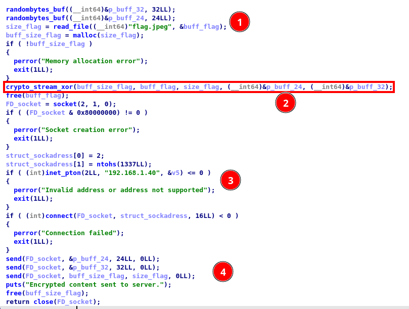
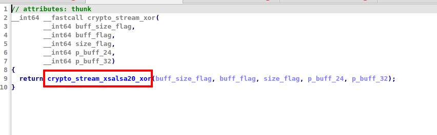
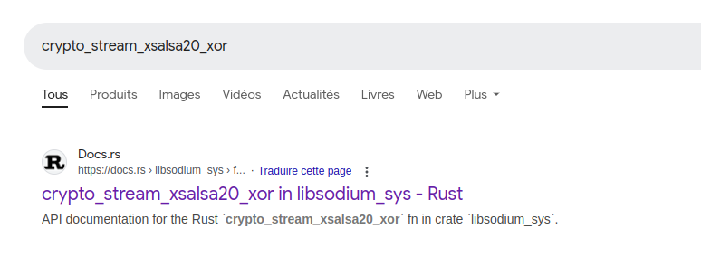
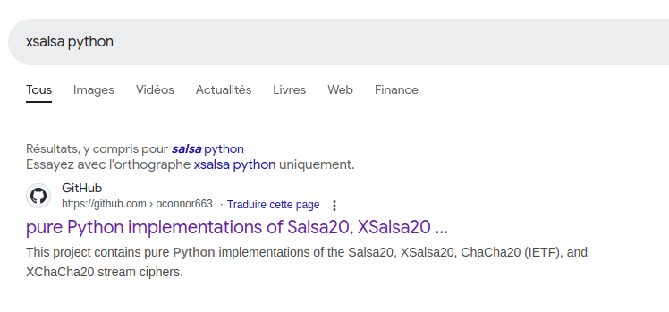
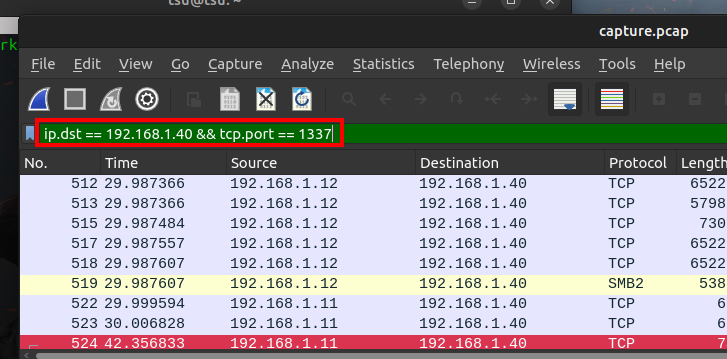
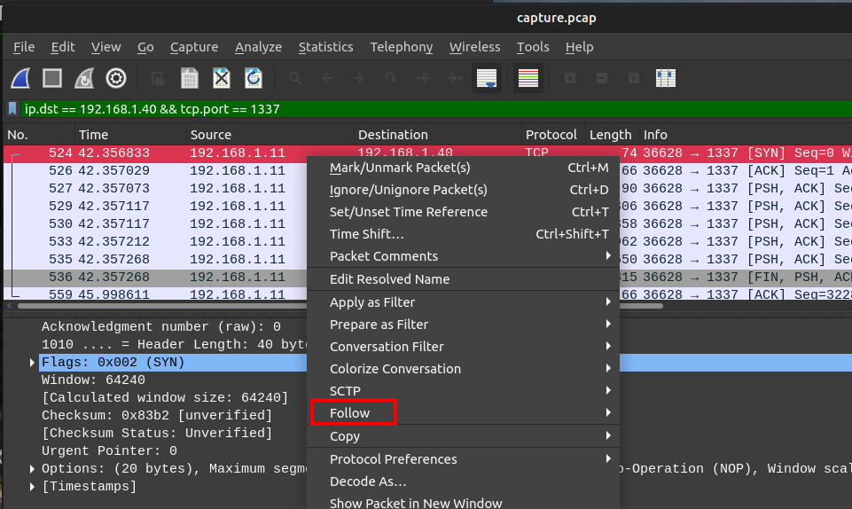
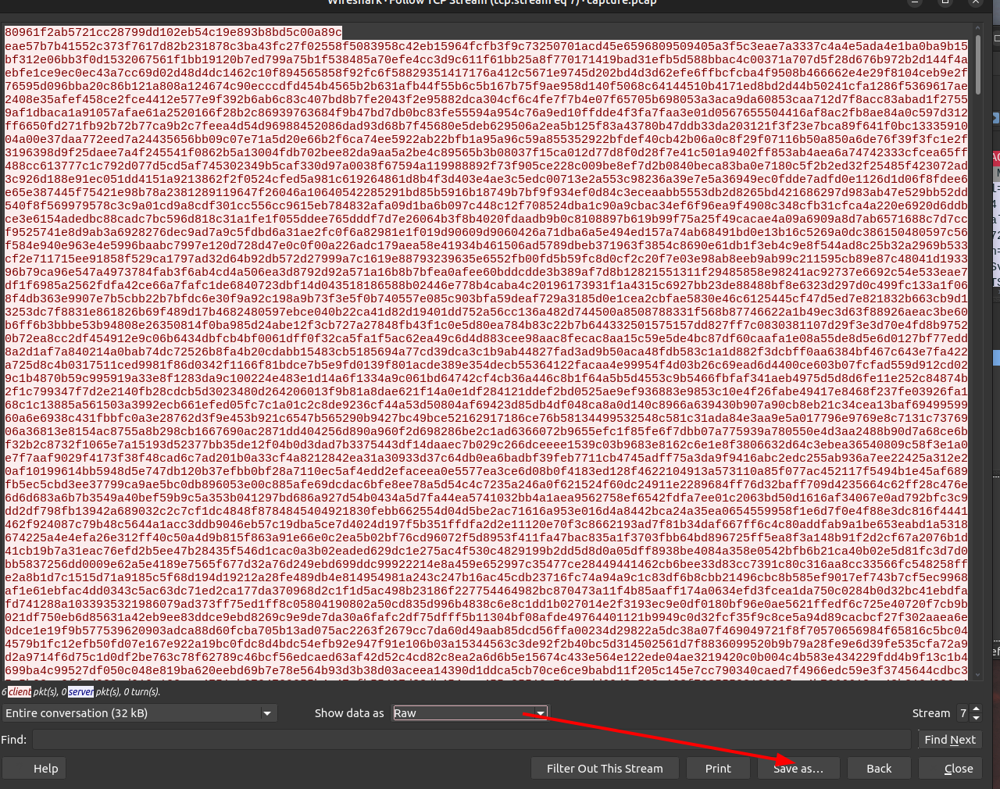
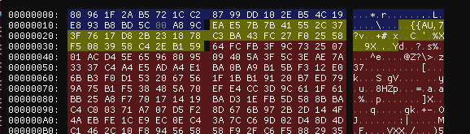
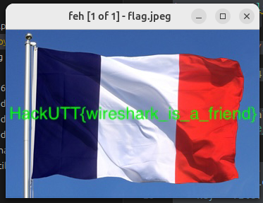

### reverse me

>consigne : Il y a juste à trouver le bon input et c'est gagné. Facile non ?

💽 binaire : reverse_1

### Reverse 2

>consigne : Il y a juste à trouver le bon input et c'est gagné. Facile non ?

`openssl s_client -verify_quiet -quiet -connect malware.serviel.fr:1234`

💽 binaire : reverse_2
### Binaire exigent
>consigne : Un malware peut vérifier sont environnement, ce qui semble être le cas de celui ci !

>ps: pas besoin d'analyser la fonction qui déchiffre le flag, il vous sera affiché si l'environnement lui convient ;)

💽 binaire : binaire_exigent

### Botnet

>consigne : Nous avons été attaqué par de méchants pirates.  
Mais visiblement ils ne sont pas très doués car on a retrouvé le binaire du C2 et de la souche sur les pc.  
En plus nous faisons des captures réseau régulièrement !

>Veuillez vérifier si de la donnée a été exfiltrée

💽 binaire : c2, souche, capture.pcap

#### analyse de la souche

##### Fonction main 

🕵️‍♂️ Nous avons deux créations de buffer de taille 32 bytes et 24 bytes. Ces buffer sont initialisé avec de la donnée random. Notons qu'il s'agit d'une fonction de la lib libsodium


🕵️‍♂️ Une fois le renommage/retypage effectué, le process le fonctionnement global du malware est facilement compréhensible :



1) Nous avons la création de deux buffer remplis de random data. L'un d'une taille de 32 bytes et l'autre d'une taille de 24 bytes. Ensuite, le contenu de "flag.jpeg" est placé dans le buffer "buff_flag".
2) Nous avons une fonction de chiffrement qui prend en paramétres le flag, le buff_24 et le buff_32,
3) Nous avons une connexion initialisée vers 192.168.1.40 sur le port 1337,
4) Et enfin nous avons l'envoie des deux buffer de 24 et 32 bytes puis du buff_size_flag qui semble contenir le fichier flag.jpeg. Analysons la fonction crypto_stream_xor pour en comprendre le contenu.

##### Fonction crypto_stream_xor


🕵️‍♂️ Contenu de la fonction crypto_stream : 



🕵️‍♂️ Nous avons une deuxiéme référence à libsodium :




🔗 https://github.com/oconnor663/pure_python_salsa_chacha

```python
import pure_salsa20
import secrets

key = secrets.token_bytes(32)
nonce = secrets.token_bytes(24)
plaintext = b"hello world"

# encryption
ciphertext = pure_salsa20.xsalsa20_xor(key, nonce, plaintext)

# decryption
assert plaintext == pure_salsa20.xsalsa20_xor(key, nonce, ciphertext)
```

🕵️‍♂️ Il est interressant de voir nos deux valeurs de 32 et 24 bytes ! Dans le code suivant 24 -> nonce, 32 -> Key

##### Exploitation

🕵️‍♂️ Dans le pcap capturé nous pouvons récupérer la donnée transmises. Pour cela il faut identifier la transmission de donnée par le malware.
🕵️‍♂️ Un filtre sur le port 1337 et sur l'ip de destination 192.168.1.40 :

```bash
ip.dst == 192.168.1.40 && tcp.port == 1337
```



🕵️‍♂️ Avec un click droit sur la trame puis Follow -> TCP Stream nous pouvons afficher le flux TCP des données envoyés :



🕵️‍♂️ Puis on peut extraire les données et les sauvegarder au format raw : 



🕵️‍♂️ Donc dans l'ordre d'envoie des données au serveur on a : 

label : vue hexadécimal de la donnée exportée sur wireshark

- En bleu : Les 24 bytes representant le nonce
- En jaune : les 32 bytes representant la clé
- En rouge : Le reste de la donnée chiffrée contenant le flag.jpeg

🕵️‍♂️ Il nous reste plus qu'à écrire le script d'exploitation : 

```python
#from pwn import *
import pure_salsa20
import secrets

path = "/media/sharedlab/export_data_botnet"
key_size = 32
nonce_size = 24


def decrypt_xsalsa(key, nonce, ciphertext):
    return pure_salsa20.xsalsa20_xor(key, nonce, ciphertext)


with open(path, "rb") as file:
    nonce = file.read(nonce_size)
    key = file.read(key_size)
    encrypted_data = file.read()
    file.close()


flag = decrypt_xsalsa(key,nonce,encrypted_data)
with open("./flag.jpeg","wb") as file:
    file.write(flag)
    file.close()
```

🎇 Il nous reste plus qu'à lire le fichier créé :


#### analyse du pcap
### Backdoor kernel

>consigne : Un nouvel employé de l'entreprise Evil Corp a pour mission d'auditer la sécurité du noyau linux utilisé au sein de l'entreprise. Il vous demande d'installer ce module _"à des fins de debug"_  
Vérifiez qu'il n'a pas d'autres idées derrière la tête

`openssl s_client -verify_quiet -quiet -connect kernel.serviel.fr:1234`

💽 binaire : backdoor.ko
### pong

>consigne : J'ai fait quelques modifications dans la commande `ping`, vous m'en direz des nouvelles !

>ps: Pas besoin d'exploiter les vulnérabilités trouvées, appelez moi quand vous avez 4 POC

`openssl s_client -verify_quiet -quiet -connect pong.serviel.fr:1234`

💽 binaire : pong.org, ping.c, ping_common.c, ping_common.h
### SSP 1/2
>consigne : SSP: Super Secure Protocole  
J'ai eu une super idée de protocole ultra sécurisé sans secret partagé, voici un serveur l'implémentant.

>Je vous laisse le soin d'écrire le client permettant de se connecter au serveur !

`openssl s_client -verify_quiet -quiet -connect ssp.serviel.fr:1234`

💽 binaire : server
### SSP 2/2
>consigne : Maintenant que vous êtes à l'aise avec mon super secure protocole, pouvez vous audier le code du serveur ?

`openssl s_client -verify_quiet -quiet -connect ssp.serviel.fr:1234`

💽 binaire : idem SSP 1/2

💽 binaire :
### Pong revenge
>consigne : Maintenant que vous avez trouvé des vulnérabilités dans mon binaire `pong`, essayez de les exploiter

`openssl s_client -verify_quiet -quiet -connect pong.serviel.fr:1234`

💽 binaire : idem que pong