🚧 ==Attention== : Ici ce ne sont pas des vrais malware, mais il est recommandé (obligatoire) de les lancer dans une VM déconnectée du réseau (avec prise de snapshot) ou à minima dans un docker.

```bash
docker run --rm -it -v ./malware.bin:/malware.bin ubuntu:22.04
```
### Kill switch

>consigne : Trouvez le kill switch pour désactiver le malware

💽 binaire : 1_chall

🕵️‍♀️ Ici on a une fonction main qui ressemble à ça (après renommage des fonctions) :

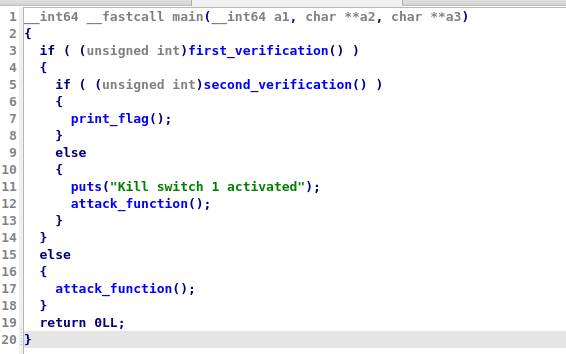

🕵️‍♀️ Donc il faut qu'on valide "first verification" et "second vérification" pour remporter le flag

##### first verification

🕵️‍♀️ Pour cette première vérification, c'est plutôt simple, le malware check si un fichier folder dans le répertoire "/I/dont/know/this/" contient "IWANTTOSTOP" :

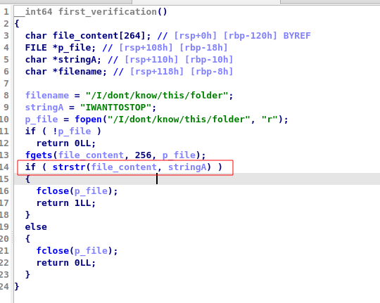

🕵️‍♀️ On prépare notre code python pour générer ce fichier : 

```python
from pwn import *
import os


path = './I/dont/know/this/'
contenu = "IWANTTOSTOP"

file_name = "folder"
os.makedirs(path, exist_ok=True)

file_path = os.path.join(path, file_name)

with open(file_path, "w", encoding="utf-8") as file:
    file.write(contenu)

print(f"Fichier créé et rempli avec succès à : {file_path}")
```

##### Deuxième vérification

🕵️‍♂️ Ici, on doit valider "second_verification" :


Mais, qu'est-ce qu'on attend comme retour pour valider le IF ? allons voir le code assembleur : 

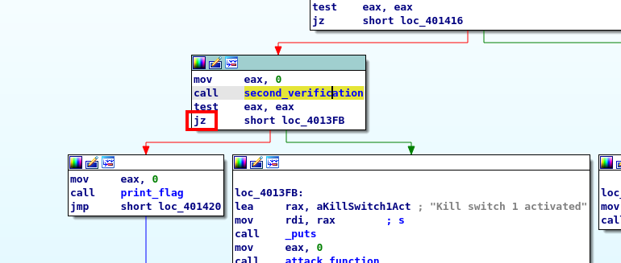
	 
🕵️‍♂️ Si eax = 0 le zero flag et mis à 0 et on saute vers print_flag, 

🕵️‍♂️ Du coup, dans la fonction "second_verification" il nous faut une valeur de retour à 0 : 

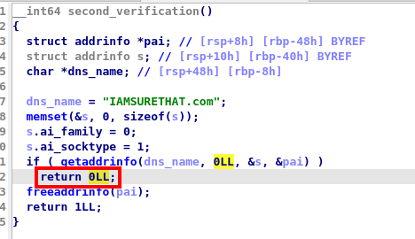
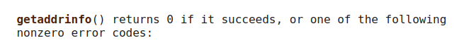

🕵️‍♂️ Pour avoir une valeur de retour à 0 il faut, donc, que le binaire arrive à résoudre "IAMSURETHAT.com"

🕵️‍♂️ Hors, si on se rappelle nos cours de réseau ! Notre resolveur dns local sera interrogé en premier. Du coup, il nous faut juste remplir notre fichier /etc/hosts (linux) ou C:\Windows\System32\Drivers\etc\hosts (windows)

🕵️‍♂️ On ajoute ce check dans notre  python : 

```python
from pwn import *
import os


path = '/I/dont/know/this/'
contenu = "IWANTTOSTOP"
file_name = "folder"

host_path = '/etc/hosts'
dns_entry = "127.0.0.1 IAMSURETHAT.com"

os.makedirs(path, exist_ok=True)

file_path = os.path.join(path, file_name)

with open(file_path, "w", encoding="utf-8") as file:
    file.write(contenu)

with open(host_path,"a", encoding="utf-8") as file:
    file.write(dns_entry)

io = process(["./1_chal"])

io.interactive()
```
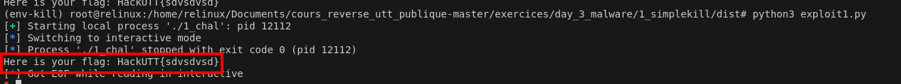
🎇

### Malware

>consigne : Ma grand-mère a reçu un mail contenant cet executable. Ca me semble louche mais je n'arrive pas à dire pourquoi. Je vous donne un accès à son pc, pouvez vous vérifiez que rien n'a été compromis ?

`openssl s_client -verify_quiet -quiet -connect malware.serviel.fr:1234`

💽 binaire : 2_chal

🕵️‍♀️ Dans la function main, on retrouve la création d'un fichier de log ("/tmp/keys.log") et deux fonctions à reverser (1 et 2)

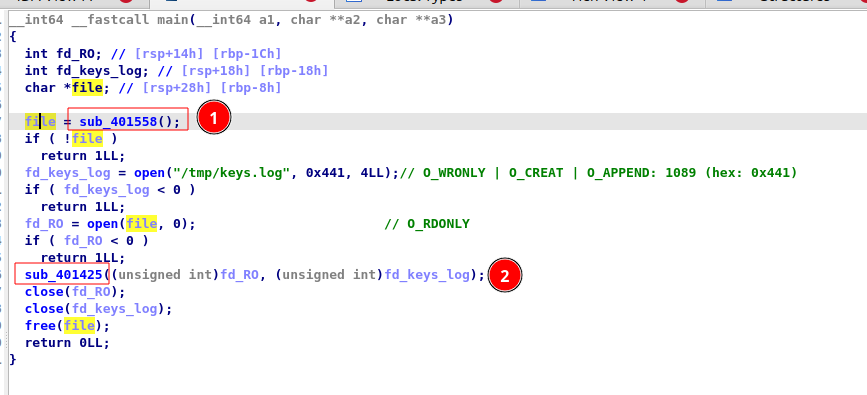

##### Function 1

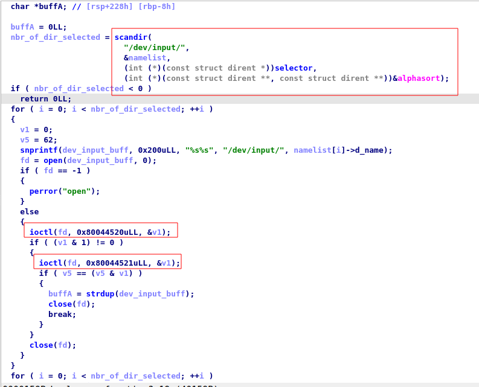

ioctl : La fonction **ioctl**() modifie le comportement des périphériques sous-jacents des fichiers spéciaux. En particulier, de nombreuses caractéristiques des fichiers spéciaux en mode caractère (par exemple des terminaux) peuvent être contrôlées avec des requêtes **ioctl**().

🕵️‍♀️ cette fonction semble manipuler le comportement des périphériques des fichiers spéciaux contenus dans /dev/input :

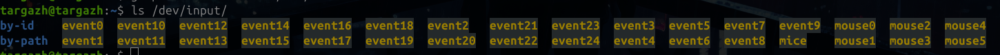
Le répertoire `/dev/input` sous Linux contient des fichiers de périphériques liés aux **entrées utilisateur**, comme les claviers, souris, écrans tactiles, et autres dispositifs d'entrée.

🕵️‍♀️ Cette fonction en recherche un périphérique d'entrée spécifique dans le répertoire `/dev/input/`, vérifie ses caractéristiques à l'aide des appels ioctl, puis renvoie le chemin du périphérique trouvé sous forme de chaîne de caractères. D'après des recherches internet, on peut supposer que le périphérique recherché est un clavier ou une souris.

🕵️‍♀️ Ça à tout l'air d'un keylogger !

##### Function 2

🕵️‍♀️ Ici tant qu'on n'envoie pas une interruption de type "CTRL + C" Le keyloger continue de logger

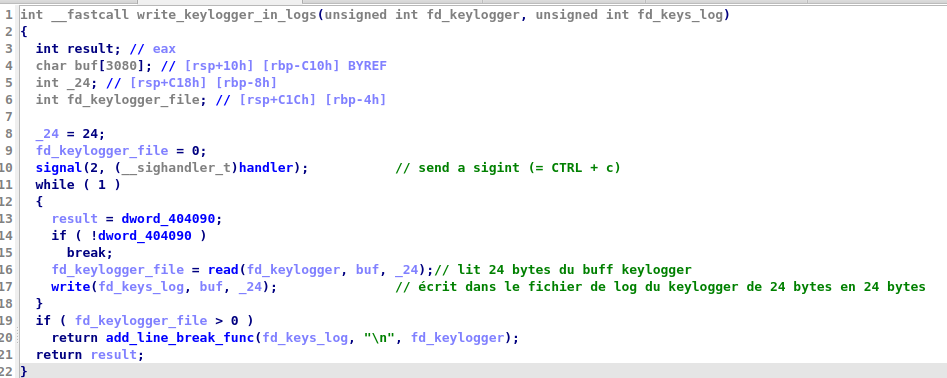

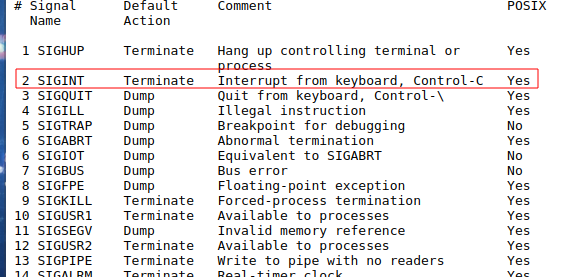

#### Exploitation

🕵️‍♀️ Le fonctionnement du programme est assez simple à comprendre, il enregistre des entrées utilisateur et les écrits dans "/tmp/keys.log"

🕵️‍♀️ Si on lance le binaire, on retrouve bien le fichier de logs :

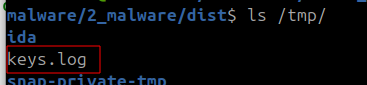

🕵️‍♀️ En revanche, le contenu est illisible : 

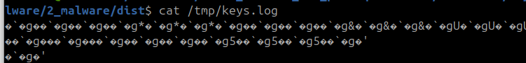


🕵️‍♀️ Et c'est normal ! Dans le prochain paragraphe on va expliquer pourquoi (attention ça pique un peu !) :

##### How input works
ℹ️ Pour la démonstration, nous allons prendrles entréesée du clavier

💡 X11 (https://en.wikipedia.org/wiki/X_Window_System#Software_architecture) lit les entrées du clavier depuis le kernel, les parses et leutilisentts poudiverses applicationses.

💡 Les sources d'inputs x11 sont appelés "event" et sont stockés dans "/dev/input" (clavier, souris, joystick etc...). D'ailleurs, voupouvez allerez y jeter un oeil sur votre ordinateur : 

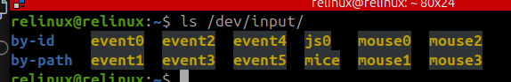

💡 Mais comment je peux savoir quel event et lié à quel input ? Il faut aller voir les fichier dans /proc/bus/input/devices : 

```bash
less /proc/bus/input/devices 
```

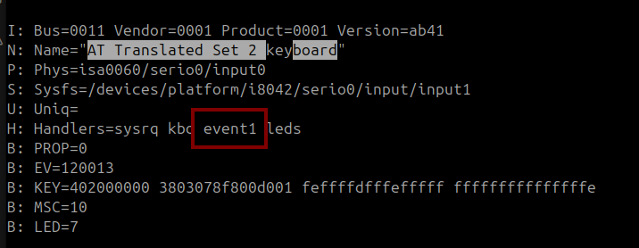

Ici ça sera l'event 1 pour mes entrées clavier ! On peut d'ailleurs faire le test pour voir les données écrites. En faisant le test on se rend compte qu'il capture aussi bien au moment où on appuit sur le touche mais aussi quand on relâche la touche ! :

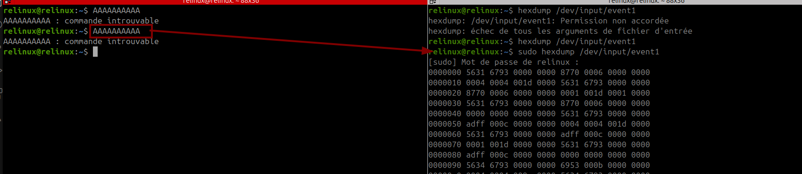

🕵️‍♂️ Si on suit la documentation linux on sait qu'un input stream à le format suivant : 

```c
struct input_event {
	struct timeval time; //timestamp sur 16 bytes
	unsigned short type; //type de l'event sur 2 bytes
	unsigned short code; // code de la touche sur 2 bytes
	unsigned int value; // Etat de la touche (pressée, relachée, répétée) sur 4 bytes
};

struct timeval{
	time_t tv_sec; /* uint64 - Seconds since the epoch */ 
	suseconds_t tv_usec; /* uint64 - Micro seconds */
}
```

**Total size** = 24 bytes

🕵️‍♂️ D'où l'écriture de chunk de 24 bytes dans le code du keylogger. 

🕵️‍♂️ Si l'on souhaite connaitre les valeurs de ces types, codes et key values, on peut aller voir le code source de linux : 

- Event types : https://github.com/torvalds/linux/blob/8096acd7442e613fad0354fc8dfdb2003cceea0b/include/uapi/linux/input-event-codes.h#L35
- Event codes : https://www.kernel.org/doc/Documentation/input/event-codes.txt avec les correspondance en valeur https://github.com/torvalds/linux/blob/8096acd7442e613fad0354fc8dfdb2003cceea0b/include/uapi/linux/input-event-codes.h#L75-L338
- Key values : is the value the event carries. Either a relative change for `EV_REL`, absolute new value for `EV_ABS` (joysticks ...), or 0 for `EV_KEY` for release, ==1 for key-press== and 2 for autorepeat.

On peut également avoir des informations trés détaillées sur toutes les valeurs de cette structure dans la documentation du noyau linux : 
https://www.kernel.org/doc/html/v4.18/input/event-codes.html 😍

💡Ce qui nous intéresse dans le cadre des inputs keyboard :

- ==Event type== : 

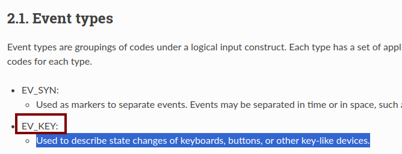

- ==Event codes== : Ici ce sont différentes valeurs que peuvent prendre les "Event type". C'est sur cette valeur qu'on va pouvoir avoir quelle touche a été enfoncée :

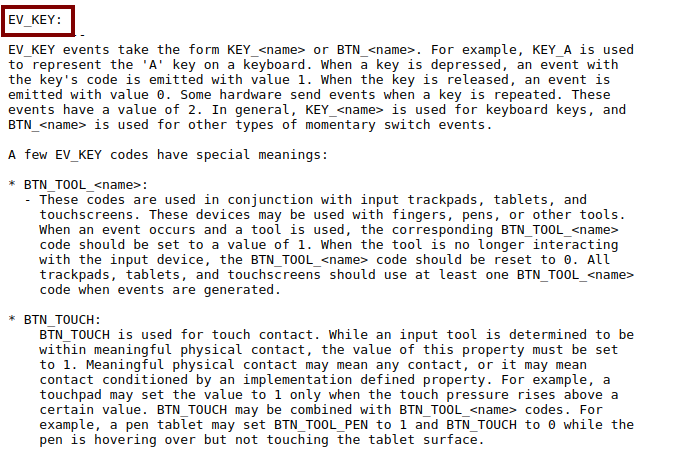

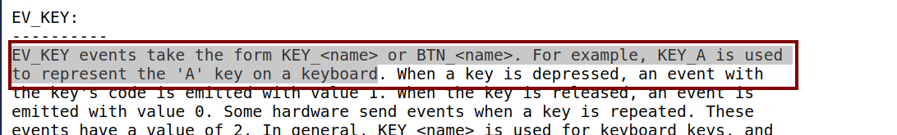

 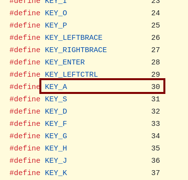
 
- ==Key Value== : Ici ça va nous permettre de sélectionne uniquement les touches qui ont été "pressées"  

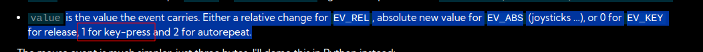

🕵️‍♂️ Maintenant qu'on a compris le fonctionnement global, nous allons écrire un script pour voir si on a compris.

🕵️‍♂️ Pour ce faire, nous allons générer des logs avec les entrées A - B - C -D - E

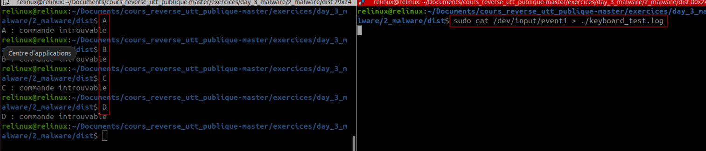

🕵️‍♀️ Déjà, on remarque bien un pattern qui se répète tous les 24 bytes : 


🕵️‍♀️ Vu que chaque input est écrit sur un total de 24 bytes, nous allons parcourir le fichier 24bytes par 24 bytes,
🕵️‍♀️  Et ce, suivant la structure qu'on avait défini plus tôt on a  :

```c
struct input_event {
	struct timeval time; -> 0891 6794 0000 0000 (16 bytes)
	unsigned short type; -> 0004 (2bytes)
	unsigned short code; -> 0004 (2bytes)
	unsigned int value; -> 0000002a (4bytes) = 42 -> 
};
struct timeval{
	time_t tv_sec; -> 0000000067940891
	suseconds_t tv_usec; -> 000bdf5300000000
}
```

🕵️‍♀️ On peut déjà écrire un script qui va extraire les events types = 0x1 qui sont liées aux evévénements clavier : 

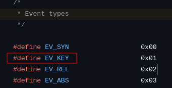

🕵️‍♀️ Pour 1 la value est 30 (0x1e) et B la value est 48 (0x30)

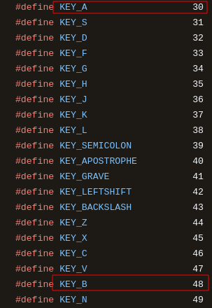

```python
import struct

def main():
    keylog_file_path = "./keyboard_test.log"

    with open(keylog_file_path,"rb") as file:
        while True:
            try:
                data = file.read(24)          
                data = struct.unpack('4IHHI', data) # 4I -> 4 int, HH -> 2 short, un int
                
                """ 
                Suivant la structure ci-dessous, il nous reste plus qu'à extraire chaque valeur
                    struct input_event {
                struct timeval time; //timestamp sur 16 bytes
                unsigned short type; //type de l'event sur 2 bytes
                unsigned short code; // code de la touche sur 2 bytes
                unsigned int value; // Etat de la touche (pressée, relachée, répétée) sur 4 bytes
            }; """

                timestamp = data[0] # Le premier int de timevale c'est le timestamp en secondes
                input_type = data[4] # si = 1 -> Keyboard event
                input_code = data[5] # Il faut lire les valeurs pour connaitre leurs correspondances
                input_value = data[6] # si = 1 -> key pressed
        
                if input_type == 1 and input_value == 1 and input_code == 48 : # je vérifie si c'est égale à 'B' 
                    print(timestamp)
                    print(input_type)
                    print(input_code)
                    print(input_value)
            except Exception as e:
                 break
           
if __name__ == '__main__':
    main()
```

Et on retrouve bien la touche B qui a été pressée :

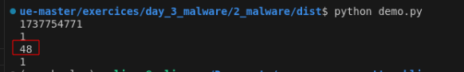

🕵️‍♀️ Par contre pour le A, par défaut, il il se base sur un clavier qwerty, du coup au lieu du A il a reconnu un Q !!! Il va falloir adapter ça dans notre code.

```python
import struct
from datetime import datetime

code_dict_qwerty = {
    0: '[RESERVED]',
    1: '[ESC]',
    2: '1',
    3: '2',
    4: '3',
    5: '4',
    6: '5',
    7: '6',
    8: '7',
    9: '8',
    10: '9',
    11: '0',
    12: '-',
    13: '=',
    14: '[BACKSPACE]',
    15: '[TAB]',
    16: 'q',
    17: 'w',
    18: 'e',
    19: 'r',
    20: 't',
    21: 'y',
    22: 'u',
    23: 'i',
    24: 'o',
    25: 'p',
    26: '^',
    27: '$',
    28: '[ENTER]\n',
    29: '[L_CTRL]',
    30: 'a',
    31: 's',
    32: 'd',
    33: 'f',
    34: 'g',
    35: 'h',
    36: 'j',
    37: 'k',
    38: 'l',
    39: ';',
    40: '!',
    41: '`',
    42: '[L_SHIFT]',
    43: '\\',
    44: 'z',
    45: 'x',
    46: 'c',
    47: 'v',
    48: 'b',
    49: 'n',
    50: 'm',
    51: ',',
    52: '.',
    53: '/',
    54: '[R_SHIFT]',
    55: '*',
    56: '[L_ALT]',
    57: ' ',
    58: '[CAPSLOCK]',
    59: '[F1]',
    60: '[F2]',
    61: '[F3]',
    62: '[F4]',
    63: '[F5]',
    64: '[F6]',
    65: '[F7]',
    66: '[F8]',
    67: '[F9]',
    68: '[F10]',
    69: '[NUMLOCK]',
    70: '[SCROLLLOCK]',
    71: '7',
    72: '8',
    73: '9',
    74: '-',
    75: '4',
    76: '5',
    77: '6',
    78: '+',
    79: '1',
    80: '2',
    81: '3',
    82: '0',
    83: '.',
    84: '',
    85: '[ZENKAKUHANKAKU]',
    86: '<',
    87: '[F11]',
    88: '[F12]',
    89: '[RO]',
    90: '[KATAKANA]',
    91: '[HIRAGANA]',
    92: '[HENKAN]',
    93: '[KATAKANAHIRAGANA]',
    94: '[MUHENKAN]',
    95: '[KPJPCOMMA]',
    96: '[ENTER]\n',
    97: '[R_CTRL]',
    98: '[KPSLASH]',
    99: '[SYSRQ]',
    100: '[R_ALT]',
    101: '[LINEFEED',
    102: '[HOME]',
    103: '[UP]',
    104: '[PAGEUP]',
    105: '[LEFT]',
    106: '[RIGHT]',
    107: '[END]',
    108: '[DOWN]',
    109: '[PAGEDOWN]',
    110: '[INSERT]',
    111: '[DEL]',
    112: '[MACRO]',
    113: '[MUTE]',
    114: '[VOLUMEDOWN]',
    115: '[VOLUMEUP]',
    116: '[POWER]',
    117: '[KPEQUAL]',
    118: '[KPPLUSMINUS]',
    119: '[PAUSE]',
    120: '[SCALE]',
    121: '[KPCOMMA]',
    122: '[HANGEUL]',
    123: '[HANJA]',
    124: '[YEN]',
    125: '[LEFTMETA]',
    126: '[RIGHTMETA]',
    127: '[COMPOSE]',
    128: '[STOP]',
    129: '[AGAIN]',
    130: '[PROPS]',
    131: '[UNDO]',
    132: '[FRONT]',
    133: '[COPY]',
    134: '[OPEN]',
    135: '[PASTE]',
    136: '[FIND]',
    137: '[CUT]',
    138: '[HELP]',
    139: '[MENU]',
    140: '[CALC]',
    141: '[SETUP]',
    142: '[SLEEP]',
    143: '[WAKEUP]',
    144: '[FILE]',
    145: '[SENDFILE]',
    146: '[DELETEFILE]',
    147: '[XFER]',
    148: '[PROG1]',
    149: '[PROG2]',
    150: '[WWW]',
    151: '[MSDOS]',
    152: '[SCREENLOCK]',
    153: '[ROTATE_DISPLAY]',
    154: '[CYCLEWINDOWS]',
    155: '[MAIL]',
    156: '[BOOKMARKS]',
    157: '[COMPUTER]',
    158: '[BACK]',
    159: '[FORWARD]',
    160: '[CLOSECD]',
    161: '[EJECTCD]',
    162: '[EJECTCLOSECD]',
    163: '[NEXTSONG]',
    164: '[PLAYPAUSE]',
    165: '[PREVIOUSSONG]',
    166: '[STOPCD]',
    167: '[RECORD]',
    168: '[REWIND]',
    169: '[PHONE]',
    170: '[ISO]',
    171: '[CONFIG]',
    172: '[HOMEPAGE]',
    173: '[REFRESH]',
    174: '[EXIT]',
    175: '[MOVE]',
    176: '[EDIT]',
    177: '[SCROLLUP]',
    178: '[SCROLLDOWN]',
    179: '[KPLEFTPAREN]',
    180: '[KPRIGHTPAREN]',
    181: '[NEW]',
    182: '[REDO]',
    183: '[F13]',
    184: '[F14]',
    185: '[F15]',
    186: '[F16]',
    187: '[F17]',
    188: '[F18]',
    189: '[F19]',
    190: '[F20]',
    191: '[F21]',
    192: '[F22]',
    193: '[F23]',
    194: '[F24]',
    195: '',
    196: '',
    197: '',
    198: '',
    199: '',
    200: '[PLAYCD]',
    201: '[PAUSECD]',
    202: '[PROG3]',
    203: '[PROG4]',
    204: '[ALL_APPLICATIONS]',
    205: '[SUSPEND]',
    206: '[CLOSE]',
    207: '[PLAY]',
    208: '[FASTFORWARD]',
    209: '[BASSBOOST]',
    210: '[PRINT]',
    211: '[HP]',
    212: '[CAMERA]',
    213: '[SOUND]',
    214: '[QUESTION]',
    215: '[EMAIL]',
    216: '[CHAT]',
    217: '[SEARCH]',
    218: '[CONNECT]',
    219: '[FINANCE]',
    220: '[SPORT]',
    221: '[SHOP]',
    222: '[ALTERASE]',
    223: '[CANCEL]',
    224: '[BRIGHTNESSDOWN]',
    225: '[BRIGHTNESSUP]',
    226: '[MEDIA]',
    227: '[SWITCHVIDEOMODE]',
    228: '[KBDILLUMTOGGLE]',
    229: '[KBDILLUMDOWN]',
    230: '[KBDILLUMUP]',
    231: '[SEND]',
    232: '[REPLY]',
    233: '[FORWARDMAIL]',
    234: '[SAVE]',
    235: '[DOCUMENTS]',
    236: '[BATTERY]',
    237: '[BLUETOOTH]',
    238: '[WLAN]',
    239: '[UWB]',
    240: '[UNKNOWN]',
    241: '[VIDEO_NEXT]',
    242: '[VIDEO_PREV]',
    243: '[BRIGHTNESS_CYCLE]',
    244: '[BRIGHTNESS_AUTO]',
    245: '[DISPLAY_OFF]',
    246: '[WWAN]',
    247: '[RFKILL]',
    248: '[MICMUTE]'
}
azerty = '²&é"\'(-è_çà)=azertyuiop^$qsdfghjklmù*<wxcvbn,;:!1234567890'

def main():
    keylog_file_path = "./keyboard_test.log"
   
    result = []
    begining_keylog = ""
    readable_date = ""
    with open(keylog_file_path,"rb") as file:
        while True:
            try:
                data = file.read(24)
                data = struct.unpack('4IHHI', data) # 4I -> 4 int, HH -> 2 short, un int
                timestamp = data[0]
                
                if not timestamp:
                    break
                input_type = data[4]
                input_code = data[5]
                input_value = data[6]
        
                
                if  begining_keylog == "":
                    dt_object = datetime.fromtimestamp(timestamp)
                    readable_date = dt_object.strftime('%Y-%m-%d %H:%M:%S')
                
                if  input_type == 1 and input_value == 1 and code_dict_qwerty[input_code] in azerty: 
                    
                    key = code_dict_qwerty[input_code]
                    result.append(key)
                        
            except Exception as e:
                 break
    
    
    print("Début du keylogging : " + readable_date + "\n")
    print("qwerty_us : " + ''.join(result))
  

   
if __name__ == '__main__':
    main()
```

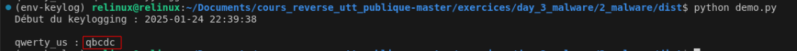

🕵️‍♀️ Nickel, notre code a l'air de bien fonctionner. On n'a plus qu'à le tester sur notre chall : 

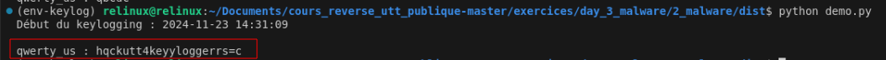

🤡 How noooo, ça ne marche pas. Ça ne doit pas être un clavier qwerty...

🕵️‍♀️ Nous avons redéfini plusieurs "keyboard layout" : 

```python
keyboard_layouts = {
    
    "qwerty_us": '`1234567890-=qwertyuiop[]asdfghjkl;\'\\\\zxcvbnm,./',
    "qwerty_uk": '`1234567890-=qwertyuiop[]asdfghjkl;\'#\\zxcvbnm,./',
    "azerty_fr": '²&é"\'(-è_çà)=azertyuiop^$qsdfghjklmù*<wxcvbn,;:!',
    "azerty_belgique": '²&é"\'(§è!çà)-azertyuiop^$qsdfghjklmùµ<wxcvbn,;:=',
    "azerty_canada": "`1234567890-=azertyuiop^qsdfghjklmù*wxcvbn,;:!##",
    "qwertz_de": "`1234567890-=qwertzuiopü+asdfghjklöä#<yxcvbnm,.-",
    "qwertz_ch": "°1234567890'=qwertzuiopü¨asdfghjklöä$<yxcvbnm,.-",
    "azerty_lux": "²&é\"'(-è_çà)=azertyuiop^qsdfghjklmù*wxcvbn,;:!##",
}

```

🕵️‍♀️ Final code :

```python
import binascii
from datetime import datetime
from pwn import *

keyboard_layouts = {
    
    "qwerty_us": '`1234567890-=qwertyuiop[]asdfghjkl;\'\\\\zxcvbnm,./',
    "qwerty_uk": '`1234567890-=qwertyuiop[]asdfghjkl;\'#\\zxcvbnm,./',
    "azerty_fr": '²&é"\'(-è_çà)=azertyuiop^$qsdfghjklmù*<wxcvbn,;:!',
    "azerty_belgique": '²&é"\'(§è!çà)-azertyuiop^$qsdfghjklmùµ<wxcvbn,;:=',
    "azerty_canada": "`1234567890-=azertyuiop^qsdfghjklmù*wxcvbn,;:!##",
    "qwertz_de": "`1234567890-=qwertzuiopü+asdfghjklöä#<yxcvbnm,.-",
    "qwertz_ch": "°1234567890'=qwertzuiopü¨asdfghjklöä$<yxcvbnm,.-",
    "azerty_lux": "²&é\"'(-è_çà)=azertyuiop^qsdfghjklmù*wxcvbn,;:!##",
}

code_dict_qwerty = {
    0: '[RESERVED]',
    1: '[ESC]',
    2: '1',
    3: '2',
    4: '3',
    5: '4',
    6: '5',
    7: '6',
    8: '7',
    9: '8',
    10: '9',
    11: '0',
    12: '-',
    13: '=',
    14: '[BACKSPACE]',
    15: '[TAB]',
    16: 'q',
    17: 'w',
    18: 'e',
    19: 'r',
    20: 't',
    21: 'y',
    22: 'u',
    23: 'i',
    24: 'o',
    25: 'p',
    26: '^',
    27: '$',
    28: '[ENTER]\n',
    29: '[L_CTRL]',
    30: 'a',
    31: 's',
    32: 'd',
    33: 'f',
    34: 'g',
    35: 'h',
    36: 'j',
    37: 'k',
    38: 'l',
    39: ';',
    40: '!',
    41: '`',
    42: '[L_SHIFT]',
    43: '\\',
    44: 'z',
    45: 'x',
    46: 'c',
    47: 'v',
    48: 'b',
    49: 'n',
    50: 'm',
    51: ',',
    52: '.',
    53: '/',
    54: '[R_SHIFT]',
    55: '*',
    56: '[L_ALT]',
    57: ' ',
    58: '[CAPSLOCK]',
    59: '[F1]',
    60: '[F2]',
    61: '[F3]',
    62: '[F4]',
    63: '[F5]',
    64: '[F6]',
    65: '[F7]',
    66: '[F8]',
    67: '[F9]',
    68: '[F10]',
    69: '[NUMLOCK]',
    70: '[SCROLLLOCK]',
    71: '7',
    72: '8',
    73: '9',
    74: '-',
    75: '4',
    76: '5',
    77: '6',
    78: '+',
    79: '1',
    80: '2',
    81: '3',
    82: '0',
    83: '.',
    84: '',
    85: '[ZENKAKUHANKAKU]',
    86: '<',
    87: '[F11]',
    88: '[F12]',
    89: '[RO]',
    90: '[KATAKANA]',
    91: '[HIRAGANA]',
    92: '[HENKAN]',
    93: '[KATAKANAHIRAGANA]',
    94: '[MUHENKAN]',
    95: '[KPJPCOMMA]',
    96: '[ENTER]\n',
    97: '[R_CTRL]',
    98: '[KPSLASH]',
    99: '[SYSRQ]',
    100: '[R_ALT]',
    101: '[LINEFEED',
    102: '[HOME]',
    103: '[UP]',
    104: '[PAGEUP]',
    105: '[LEFT]',
    106: '[RIGHT]',
    107: '[END]',
    108: '[DOWN]',
    109: '[PAGEDOWN]',
    110: '[INSERT]',
    111: '[DEL]',
    112: '[MACRO]',
    113: '[MUTE]',
    114: '[VOLUMEDOWN]',
    115: '[VOLUMEUP]',
    116: '[POWER]',
    117: '[KPEQUAL]',
    118: '[KPPLUSMINUS]',
    119: '[PAUSE]',
    120: '[SCALE]',
    121: '[KPCOMMA]',
    122: '[HANGEUL]',
    123: '[HANJA]',
    124: '[YEN]',
    125: '[LEFTMETA]',
    126: '[RIGHTMETA]',
    127: '[COMPOSE]',
    128: '[STOP]',
    129: '[AGAIN]',
    130: '[PROPS]',
    131: '[UNDO]',
    132: '[FRONT]',
    133: '[COPY]',
    134: '[OPEN]',
    135: '[PASTE]',
    136: '[FIND]',
    137: '[CUT]',
    138: '[HELP]',
    139: '[MENU]',
    140: '[CALC]',
    141: '[SETUP]',
    142: '[SLEEP]',
    143: '[WAKEUP]',
    144: '[FILE]',
    145: '[SENDFILE]',
    146: '[DELETEFILE]',
    147: '[XFER]',
    148: '[PROG1]',
    149: '[PROG2]',
    150: '[WWW]',
    151: '[MSDOS]',
    152: '[SCREENLOCK]',
    153: '[ROTATE_DISPLAY]',
    154: '[CYCLEWINDOWS]',
    155: '[MAIL]',
    156: '[BOOKMARKS]',
    157: '[COMPUTER]',
    158: '[BACK]',
    159: '[FORWARD]',
    160: '[CLOSECD]',
    161: '[EJECTCD]',
    162: '[EJECTCLOSECD]',
    163: '[NEXTSONG]',
    164: '[PLAYPAUSE]',
    165: '[PREVIOUSSONG]',
    166: '[STOPCD]',
    167: '[RECORD]',
    168: '[REWIND]',
    169: '[PHONE]',
    170: '[ISO]',
    171: '[CONFIG]',
    172: '[HOMEPAGE]',
    173: '[REFRESH]',
    174: '[EXIT]',
    175: '[MOVE]',
    176: '[EDIT]',
    177: '[SCROLLUP]',
    178: '[SCROLLDOWN]',
    179: '[KPLEFTPAREN]',
    180: '[KPRIGHTPAREN]',
    181: '[NEW]',
    182: '[REDO]',
    183: '[F13]',
    184: '[F14]',
    185: '[F15]',
    186: '[F16]',
    187: '[F17]',
    188: '[F18]',
    189: '[F19]',
    190: '[F20]',
    191: '[F21]',
    192: '[F22]',
    193: '[F23]',
    194: '[F24]',
    195: '',
    196: '',
    197: '',
    198: '',
    199: '',
    200: '[PLAYCD]',
    201: '[PAUSECD]',
    202: '[PROG3]',
    203: '[PROG4]',
    204: '[ALL_APPLICATIONS]',
    205: '[SUSPEND]',
    206: '[CLOSE]',
    207: '[PLAY]',
    208: '[FASTFORWARD]',
    209: '[BASSBOOST]',
    210: '[PRINT]',
    211: '[HP]',
    212: '[CAMERA]',
    213: '[SOUND]',
    214: '[QUESTION]',
    215: '[EMAIL]',
    216: '[CHAT]',
    217: '[SEARCH]',
    218: '[CONNECT]',
    219: '[FINANCE]',
    220: '[SPORT]',
    221: '[SHOP]',
    222: '[ALTERASE]',
    223: '[CANCEL]',
    224: '[BRIGHTNESSDOWN]',
    225: '[BRIGHTNESSUP]',
    226: '[MEDIA]',
    227: '[SWITCHVIDEOMODE]',
    228: '[KBDILLUMTOGGLE]',
    229: '[KBDILLUMDOWN]',
    230: '[KBDILLUMUP]',
    231: '[SEND]',
    232: '[REPLY]',
    233: '[FORWARDMAIL]',
    234: '[SAVE]',
    235: '[DOCUMENTS]',
    236: '[BATTERY]',
    237: '[BLUETOOTH]',
    238: '[WLAN]',
    239: '[UWB]',
    240: '[UNKNOWN]',
    241: '[VIDEO_NEXT]',
    242: '[VIDEO_PREV]',
    243: '[BRIGHTNESS_CYCLE]',
    244: '[BRIGHTNESS_AUTO]',
    245: '[DISPLAY_OFF]',
    246: '[WWAN]',
    247: '[RFKILL]',
    248: '[MICMUTE]'
}

def generate_output_for_other_layout(output_string):

    translations = {}
    for layout_name, layout_keys in keyboard_layouts.items():
        if layout_name != "qwerty_us":  # On ne traduit pas vers lui-même
            translations[layout_name] = str.maketrans(keyboard_layouts["qwerty_us"], layout_keys)
    for layout, translation in translations.items():
        translated = output_string.translate(translation)
       
        print(f"{layout}: {translated}")


def main():
    keylog_file_path = "./keys.log"
   
    result = []
    begining_keylog = ""
    readable_date = ""
    with open(keylog_file_path,"rb") as file:
        while True:
            try:
                data = file.read(24)
                data = struct.unpack('4IHHI', data) # 4I -> 4 int, HH -> 2 short, un int
                timestamp = data[0]
                
                if not timestamp:
                    break
                input_type = data[4]
                input_code = data[5]
                input_value = data[6]
        
                
                if  begining_keylog == "":
                    dt_object = datetime.fromtimestamp(timestamp)
                    readable_date = dt_object.strftime('%Y-%m-%d %H:%M:%S')
                
                if  input_type == 1 and input_value == 1 and code_dict_qwerty[input_code] in keyboard_layouts["azerty_fr"]: 
                    
                    key = code_dict_qwerty[input_code]
                    result.append(key)
                        
            except Exception as e:
                 break

    
    print("Début du keylogging : " + readable_date + "\n")
    print("qwerty_us : " + ''.join(result))
    generate_output_for_other_layout(''.join(result))

   
if __name__ == '__main__':
    main()
```

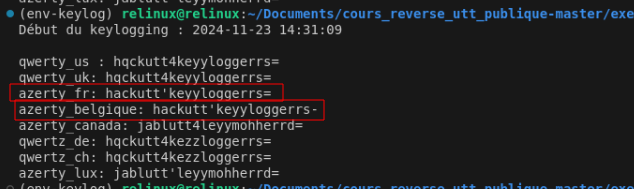

🎇🎇 C'est gagné
### Packer

>consigne : Je ne comprends pas ce binaire, le code executé n'as pas l'air de correspondre à ce que je reverse

💽 binaire : 3_chall

🕵️‍♀️ Après avoir fait le travail de renommage et retypage, nous avons une fonction main assez simple à comprendre : 

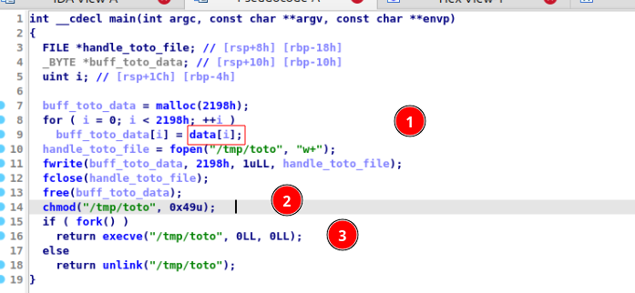

1) On écrit les bytes contenus dans "data" dans le fichier "/tmp/toto",
2) On rend /tmp/toto executable (0x49 -> 0111 -> permissoins d'exécution sur 'propriétaire' 'groupe' 'autre')
3) On exécute /tmp/toto

ℹ️ C'est pour ça que quand on lance le programme principal, on a un output totalement étrange. C'est parce que le code principal est dans toto !!!
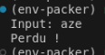

🕵️‍♀️ Le problème, c'est qu'on ne peut pas récupérer le fichier toto ! Une fois lancé, il est supprimé. Il existe deux méthodes pour le récupérer. Soit en dynamique (plus rapide), soit en statique. Ici, je vais opter pour l'option statique.


#### Unpacking

```python
from pwn import *

def main():
    elf = ELF('./3_chal')

    data_addr = elf.symbols['data']
    data_value = elf.read(data_addr, 0x2198)
    print(data_value)
if __name__ == '__main__':
    main()
```

🕵️‍♀️ Ici, on voit dans la donnée extraite qu'on a un header ELF et on retrouve des strings qu'on avait vu dans l'exécution du programme : 

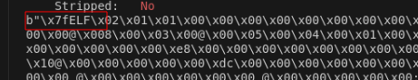
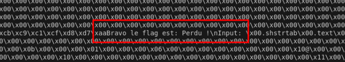

🕵️‍♀️ Écrivons cette donnée dans un fichier : 

```python
from pwn import *

def main():
    elf = ELF('./3_chal')

    data_addr = elf.symbols['data']
    data_value = elf.read(data_addr, 0x2198)

    path_unpack = "./unpack.bin"
    with open(path_unpack,"wb") as file :
        file.write(data_value)

if __name__ == '__main__':
    main()
```

🕵️‍♀️ On confirme qu'il s'agit d'un binaire exécutablee de type ELF : 

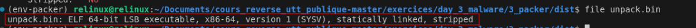

#### Reverse du binaire unpacked

🕵️‍♀️ Une fois chargé dans IDA, on retrouve bien du code à reverse !!!

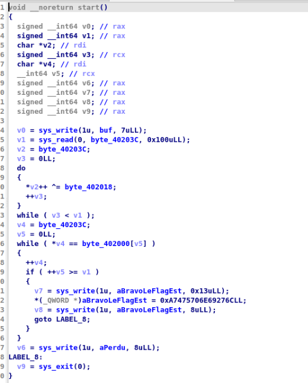

🕵️‍♀️ Explication sur ce code : 

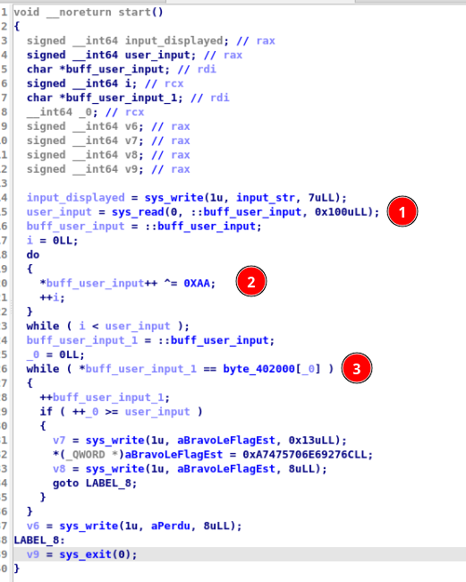

1) L'utilisateur rentre un input,
2) On xor cet input avec la clée (0xAA)
3) On compare chaque byte avec les bytes présents dans la variable "byte_402000"

🕵️‍♀️ Il nous reste plus qu'a instrumenter tout ça pour retrouver le flag !!

```python
from pwn import *
import os

def main():
    path_unpack = "./unpack.bin"
    XOR_KEY = 0xAA
    result=[]

    elf = ELF('./3_chal')

    data_addr = elf.symbols['data']
    data_value = elf.read(data_addr, 0x2198)

    
    with open(path_unpack,"wb") as file :
        file.write(data_value)
    os.chmod(path_unpack, 0o755)

    elf = ELF(path_unpack)
    data_to_match = elf.read(0x402000,0x18)
    for byte in data_to_match:
        xor_value = byte ^ XOR_KEY
        result.append(chr(xor_value))
    
    print(''.join(result))
    
    #io.sendlineafter("Input: ")
if __name__ == '__main__':
    main()
```

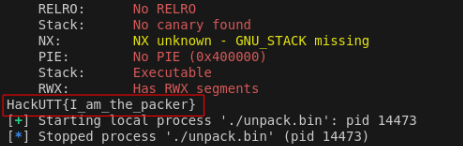

🎇 You win !
### VM

>consigne : L'objectif est simple : trouver l'entrée qui permet d'afficher "gagne"

>Le flag est ensuite: HackUTT{le mdp trouvé}

💽 binaire : 4_chall

#### Idée générale :

🕵️‍♀️ La première idée, c'est de comprendre comment la vm est créée
🕵️‍♀️ Elle va généralement créer : des registres, une stack, des instructions
🕵️‍♀️ Une fois que tu as toutes ces informations, tu pourras créer une structure. Ça va te faciliter l'analyse !!!

💡 En retour d'expérience, il est important d'identifier où est le code de la VM, où sera notre eip (génèralement il sera en début de switch case), où sera placée la stack de la VM (voir la fonction d'initialisation). Ensuite pour comprendre les instructions, j'ai fait énormément de test et de debug avec GDB. 
#### Analyse

##### Initialisation de la vm

🕵️‍♀️ Nous avons de la chance, la fonction main est explicite :

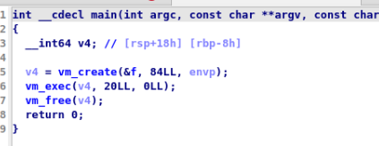

Il est important de comprendre comment la VM est créée.

🕵️‍♀️ Nous avons une allocation d'un bloc mémoire de 0x12D0

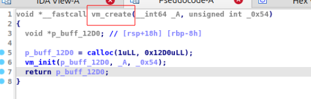

🕵️‍♀️ Ensuite on remplit cette espace mémoire :

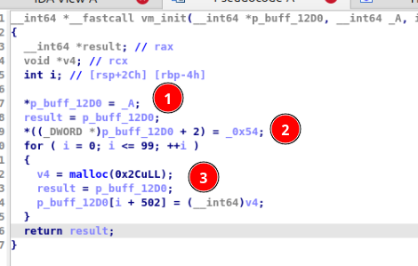

1) Ajout l'adresse de la data nommé '0xA' dans la première adresse du buffer (on verra plus tard qu'il s'agit du code de la VM),
2) Ajout de 0x54 dans la troisième adresse du buffer,
3) Le buffer est rempli 100 fois par des adresses pointant vers des buffer de taille 0x2C.

Ici nous avons l'initialisation de plusieurs buffer pour le bon fonctionnement de la VM ! 

Maintenant qu'on connait la structure globale, nous allons pouvoir créer une structure ! 

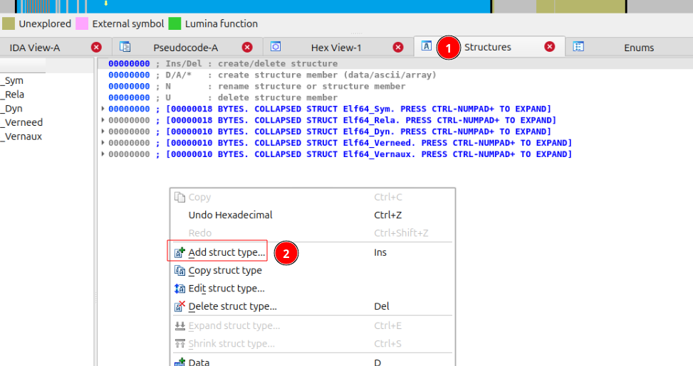

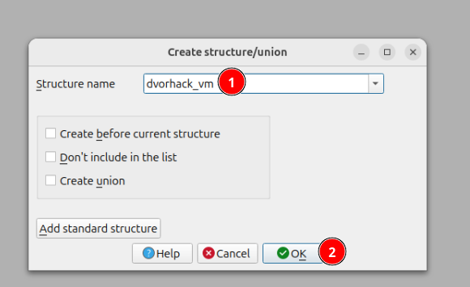

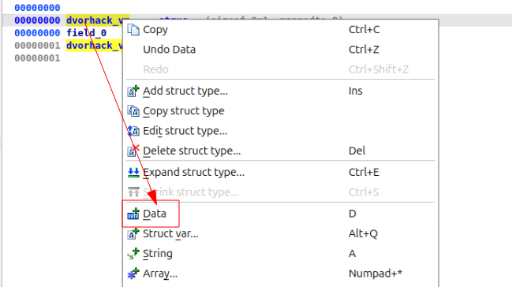

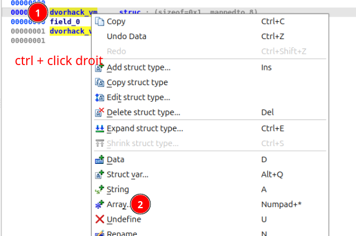

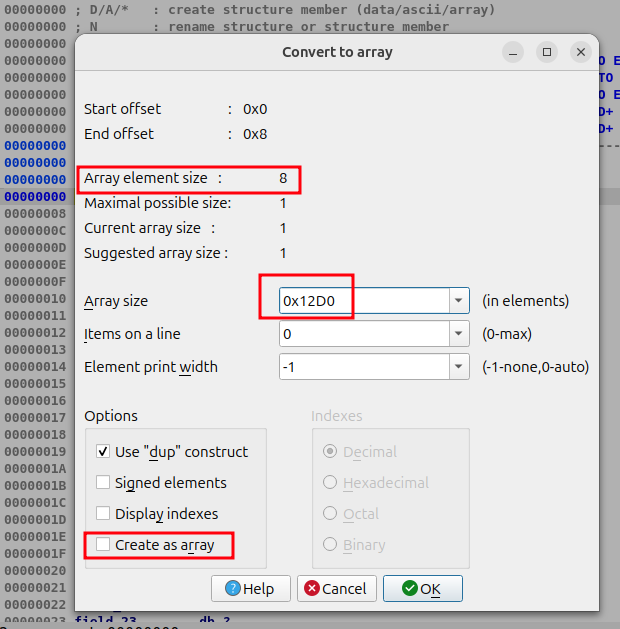

🕵️‍♀️ Maintenant, nous pouvons retyper toutes les références au buffer de 0x12D0 qui contient l'ensemble de la VM : 

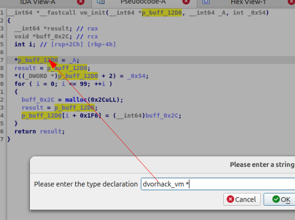

On observe déjà que ça devient beaucoup plus lisible :

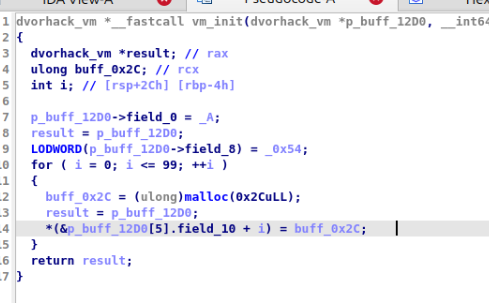
##### Execution de la VM

🕵️‍♀️ Nous allons nous rendre dans la fonction "vm_exec" afin de comprendre, ou sera placée la stack, les registres etc..

🕵️‍♀️ On a un grand switch case qui suivant la valeur donnée va exécuter des intructions. On remarque également un pattern avec des opérations différentes suivant le case (+, -, *, < etc ... ) :

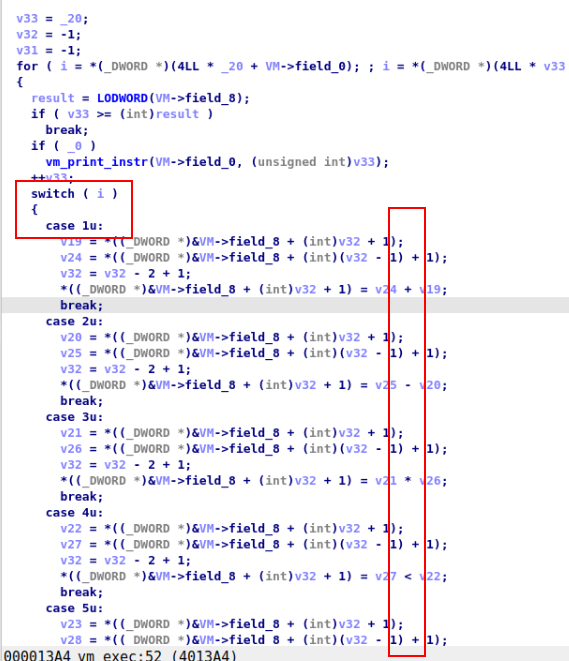

🕵️‍♀️ Il se passe plusieurs choses intéressantes. D'abord, on a une grande boucle. C'est elle qui semble récupérer les instructions pour les passer dans les cases. On pourrait dire qu'il s'agit d'EIP (le pointeur d'instruction):

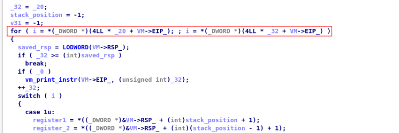

🕵️‍♀️ Dans chaque case, on place des valeurs dans des variables (qui seront certainement des registres de la VM) ces valeurs proviennent, probablement, de la stack  car celle-ci est souvent décrémentée avant chaque calcul : 

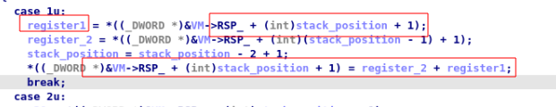

🕵️‍♀️ En y regardant de plus près, si on revient dans la fonction "vm_init" on se rend compte que ce qui pointé sur "A" c'était le code de la VM d'une taille de 0x54 : 

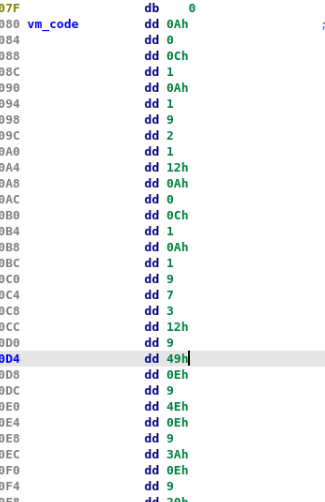


🕵️‍♀️ Donc, en premier dans le buffer on a le code puis 0x54 est placé juste avant  rsp !

🕵️‍♀️ Dans gdb on va mettre un breakpoint pour récupérer l'emplacement mémoire du buffer de la vm  pour surveiller les valeurs dans la stack

🕵️‍♀️ On va vérifier cette hypothèse, en allant récupérer l'adresse de la stack (virtuelle) avec gdb. 


🕵️‍♀️ dans la première partie du buffer, on a un pointer vers l'emplacement mémoire du code de la vm :


🕵️‍♀️ Ensuite, on a bien le 54 de la fonction init qui est placé dans le buffer : 


Pour récapituler on à :
`- break *0x40135b puis p *(unsigned char *)($rsp+0x30)` Pour récupérer la valeur de eip à chaque tour,
- `x/w 0x4052a0+12` -> premiére valeur de la stack
- `x/w 0x4052a0+16` -> deuxiéme valeur de la stack

🕵️‍♀️ Instrumentons gdb afin d'afficher nos valeurs au fur et à mesure du programme : 

```python
from pwn import *


local_file = './4_chal'


gdb_script = """
set logging on
set logging file gdb_output.txt
break *0x40135b
commands
silent
printf "Valeur de eip : "
p *(unsigned char *)($rsp+0x30)
printf "Premier élément de la stack : "
x/w 0x4052a0+12
printf "Deuxiéme élément de la stack : "
x/w 0x4052a0+16
printf "\\n"
continue
end
run
"""


p = process(local_file)


gdb = gdb.attach(p, gdbscript=gdb_script, api=True)
p.interactive()
p.close()
call_value = []
stack_begin_1 = []
stack_begin_2 = []

call_pattern = re.compile(r"Valeur de eip : \$(\d+) = 0x([0-9a-fA-F]+)")
stack_begin_function = re.compile(r"Premier élément de la stack : (0x[0-9a-fA-F]{1,8}):\s*(0x[0-9a-fA-F]+)")
stack_begin_function2 = re.compile(r"Deuxiéme élément de la stack : (0x[0-9a-fA-F]{1,8}):\s*(0x[0-9a-fA-F]+)")
with open('./gdb.txt') as file:
 for line in file:
    match_call = re.findall(call_pattern,line)
    match_begin_stack = re.findall(stack_begin_function,line)
    match_begin_stack2 = re.findall(stack_begin_function2,line)
    call_value.extend(match_call)
    stack_begin_1.extend(match_begin_stack)
    stack_begin_2.extend(match_begin_stack2)
print("call value:", call_value)
print("First stack value:", stack_begin_1)
print("Second stack value: ", stack_begin_2)
```

🕵️‍♀️ Si je lance mon script, je tombe sur 


Donc 0xf est censé être la fonction de récupération de l'user input ! Allons voir ça dans IDA : 


C'est parfait ça !! 🤩
🕵️‍♀️ Maintenant que j'ai identifié quelques fonctions, je vais les rajouter dans mon output : 

```python
from pwn import *


local_file = './4_chal'


gdb_script = """
set logging on
set logging overwrite on
set logging file gdb_output.txt

# Récupération de eip
break *0x40135b
commands
silent
printf "Valeur de eip : "
p *(unsigned char *)($rsp+0x30)
printf "\\n"
continue
end

# Récupération de la stack
break *0x4017E9
commands
silent
printf "Premier élément de la stack en début de fonction: "
x/w 0x4052a0+12
printf "Deuxième élément de la stack en début de fonction: "
x/w 0x4052a0+16
printf "\\n"
continue
end


run

"""
try:
   
    p = process(local_file)

       
    gdb = gdb.attach(p, gdbscript=gdb_script, api=True)
    p.interactive()
    p.close()

        
    call_value = []
    stack_begin_1 = []
    stack_begin_2 = []
    stack_end_1 = []
    stack_end_2 = []
    
    call_pattern = re.compile(r"Valeur de eip : \$(\d+) = 0x([0-9a-fA-F]+)")
    stack_begin_function = re.compile(r"Premier élément de la stack : (0x[0-9a-fA-F]{1,8}):\s*(0x[0-9a-fA-F]+)")
    stack_begin_function2 = re.compile(r"Deuxiéme élément de la stack : (0x[0-9a-fA-F]{1,8}):\s*(0x[0-9a-fA-F]+)")
    
    with open('./gdb.txt') as file:
        for line in file:
            match_call = re.findall(call_pattern,line)
            match_begin_stack = re.findall(stack_begin_function,line)
            match_begin_stack2 = re.findall(stack_begin_function2,line)


            call_value.extend(match_call)
            stack_begin_1.extend(match_begin_stack)
            stack_begin_2.extend(match_begin_stack2)
    
    functions_identification = {
        '1': "Add",
        '2': "Sub",
        '3': "Mul",
        '4': "Inferior or Egal",
        '5': "CMP",
        '6': "6",
        '7': "7",
        '8': "8",
        '9': "9",
        'a': "load?",
        'c': "store?",
        'e': "printf",
        'f': "Scanf",
        '11': "call?",
        '12': "12"
    }
   
    
    for call, stack, stack2 in zip(call_value,stack_begin_1,stack_begin_2) :
        print(f"func -> {functions_identification[call[1]]} \nSTACK1 : {stack[1]} STACK2 : {stack2[1]}\n")
    
      
except Exception as e:
    print(f"Erreur : {e}")


```


🕵️‍♀️ J'aimerais bien modifier mon script pour qu'il me donne la valeur de la stack à la fin de chaque fonction !

```python
from pwn import *


local_file = './4_chal'

gdb_script = """
set logging on
set logging overwrite on
set logging file gdb_output.txt

# Premier breakpoint
break *0x40135b
commands
silent
printf "Valeur de eip : "
p *(unsigned char *)($rsp+0x30)
printf "\\n"
continue
end

# Deuxième breakpoint
break *0x4017E9
commands
silent
printf "Premier élément de la stack en début de fonction: "
x/w 0x4052a0+12
printf "Deuxième élément de la stack en début de fonction: "
x/w 0x4052a0+16
printf "\\n"
continue
end

# Lancer le programme
run

"""
try:
  
    p = process(local_file)

    
    gdb = gdb.attach(p, gdbscript=gdb_script, api=True)
    p.interactive()
    p.close()

        
    call_value = []
    stack_begin_1 = []
    stack_begin_2 = []
    stack_end_1 = []
    stack_end_2 = []
 
    call_pattern = re.compile(r"Valeur de eip : \$(\d+) = 0x([0-9a-fA-F]+)")
    stack_begin_function = re.compile(r"Premier élément de la stack : (0x[0-9a-fA-F]{1,8}):\s*(0x[0-9a-fA-F]+)")
    stack_begin_function2 = re.compile(r"Deuxiéme élément de la stack : (0x[0-9a-fA-F]{1,8}):\s*(0x[0-9a-fA-F]+)")
    
    with open('./gdb.txt') as file:
        for line in file:
            match_call = re.findall(call_pattern,line)
            match_begin_stack = re.findall(stack_begin_function,line)
            match_begin_stack2 = re.findall(stack_begin_function2,line)


            call_value.extend(match_call)
            stack_begin_1.extend(match_begin_stack)
            stack_begin_2.extend(match_begin_stack2)
    
    functions_identification = {
        '1': "Add",
        '2': "Sub",
        '3': "Mul",
        '4': "Inferior or Egal",
        '5': "CMP",
        '6': "6",
        '7': "7",
        '8': "8",
        '9': "9",
        'a': "load?",
        'c': "store?",
        'e': "printf",
        'f': "Scanf",
        '11': "call?",
        '12': "12"
    }
   
    
    for call, stack, stack2 in zip(call_value,stack_begin_1,stack_begin_2) :
        print(f"func -> {functions_identification[call[1]]} \nSTACK1 : {int(stack[1],16)} STACK2 : {int(stack2[1],16)}\n")
    
      
except Exception as e:
    print(f"Erreur : {e}")

```


🕵️‍♀️ On commence à deviner ce qu'il se trâme !!! ici on peut voir une comparaison entre 21 et 13371337

🕵️‍♀️ Si on pouvait afficher le retour de la fonction ça serait encore mieux ! 


🕵️‍♀️ Pour voir si la valeur de retour est bien stockée au sommet de la stack je vais break (dans gdb) dans ma fonction "scanf", car je contrôle l'input, et je vais break en fin de boucle pour observer la valeur de la stack :


Je mets 35 en input :


Et je retrouve bien mon 35 (0x25) en sommet de stack !


🕵️‍♀️ Dans notre version du programme on observe déjà que la valeur de retour se situe en première arguments de la prochaine fonction :


🚧 Je me suis rendu compte qu'avec gdb et pwntools mon script ne prenait pas en compte mon input utilisateur et mettait 1 par défaut... Pour palier à ce problème, j 'ai fait un script gdb à part et j'ai parsé les logs avec un script python. 

1️⃣ gdb script : 

```bash
file ./4_chal
set logging on
set logging overwrite on
set logging file gdb_output.txt


break *0x40135b
commands
silent
printf "Valeur de eip : "
p *(unsigned char *)($rsp+0x30)
printf "\\n"
continue
end


break *0x4017E9
commands
silent
printf "Premier élément de la stack en début de fonction: "
x/w 0x4052a0+12
printf "Deuxième élément de la stack en début de fonction: "
x/w 0x4052a0+16
printf "\\n"
continue
end

run
```

Pour le lancer il faut ajouter cette ligne dans ~/.gdbinit

```bash
source ~/.gef-2024.06.py
source /home/relinux/Documents/cours_reverse_utt_publique-master/exercices/day_3_malware/4_VM/dist/gdb_script.gdb
```

Puis lancer gdb :

```
gdb
```

Il va faire le travaille et sauvegarder l'output dans gdb.txt

2️⃣ On va parser l'output avec python : 

```python
from pwn import *

call_value = []
stack_begin_1 = []
stack_begin_2 = []
stack_end_1 = []
stack_end_2 = []


call_pattern = re.compile(r"Valeur de eip : \$(\d+) = 0x([0-9a-fA-F]+)")
stack_begin_function = re.compile(r"Premier élément de la stack en début de fonction:\s*(0x[0-9a-fA-F]+):\s*(0x[0-9a-fA-F]+)")
stack_begin_function2 = re.compile(r"Deuxième élément de la stack en début de fonction:\s*(0x[0-9a-fA-F]+):\s*(0x[0-9a-fA-F]+)")

with open('./gdb.txt','r') as file:
    for line in file:
       
        match_call = re.findall(call_pattern,line)
        match_begin_stack = re.findall(stack_begin_function,line)
        match_begin_stack2 = re.findall(stack_begin_function2,line)
        

        call_value.extend(match_call)
        stack_begin_1.extend(match_begin_stack)
        stack_begin_2.extend(match_begin_stack2)
        
functions_identification = {
    '1': "ADD",
    '2': "SUB",
    '3': "MUL",
    '4': ">=",
    '5': "CMP",
    '6': "6",
    '7': "7",
    '8': "8",
    '9': "9",
    'a': "load?",
    'c': "store?",
    'e': "PRINTF",
    'f': "SCANF",
    '11': "CALL?",
    '12': "12"
}


""" for call, stack, stack2 in zip(call_value,stack_begin_1,stack_begin_2) :
    print(f"func --[ {functions_identification[call[1]]} ]-- \n\nSTACK1 : {int(stack[1],16)} STACK2 : {int(stack2[1],16)} ") """
GREEN = "\033[32m"
RED = "\033[31m"
RESET = "\033[0m"
YELLOW = "\033[33m"
BOLD = "\033[1m"

for i in range(len(call_value)):
    print(f"Fonction --[ {RED}{functions_identification[call_value[i][1]]}{RESET} ]--")
    print(f"Arg 1 : {GREEN}{int(stack_begin_1[i-1][1], 16)}{RESET}  Arg2 (optionnel) : {GREEN}{int(stack_begin_2[i][1], 16)}{RESET}")
    print(f"Return value: {BOLD}{YELLOW}{int(stack_begin_1[i+1][1], 16)}{RESET}")
    print()  
```

🕵️‍♀️ Pour la démonstration, j'ai mis l'input 1000, ca nous donne (aprés execution de mon script) :


On identifie bien notre scanf qui renvoit notre input égal à '1000'

💣 on peut rapidement se rendre compte qu'il y a peu d'instruction d’Intérêts pour nous :


💣 Donc pour valider la comparaison, il faut que notre input soit = (13371337/7)-2 = 1910189


💣 Testons cette input dans notre programme : 


💣 On a enfin gagné !!!! 🎇
