### 0 hello_world

> Consigne : Trouvez le bon mot de passe

💽 binaire : 0_chall

#### Execution du binaire 

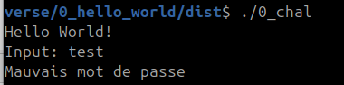
🕵️‍♀️ Ici on voit que le binaire attend un "Input" et affiche "Mauvais mot de passe".
💡 Il s'agit de trouver le bon mot de passe

#### Résolution du chall

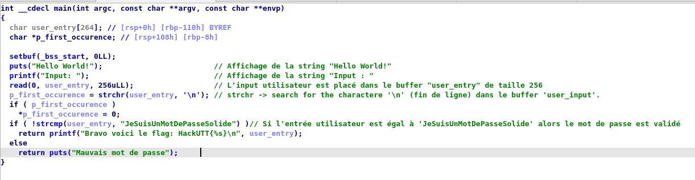
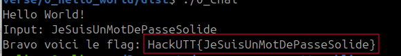

### 1 keygen

>consigne : Voici un programme qui vous demande un login, une license et en vérifie la validité. Développez un générateur de license et envoyez la license pour l'utilisateur `admin` au serveur

`openssl s_client -verify_quiet -quiet -connect keygen.serviel.fr:1234`

💽 binaire : 1_chall

#### Execution du binaire 

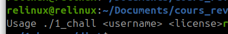
🕵️‍♀️ Le binaire attend deux arguments *username* et *license*

#### Résolution du chall

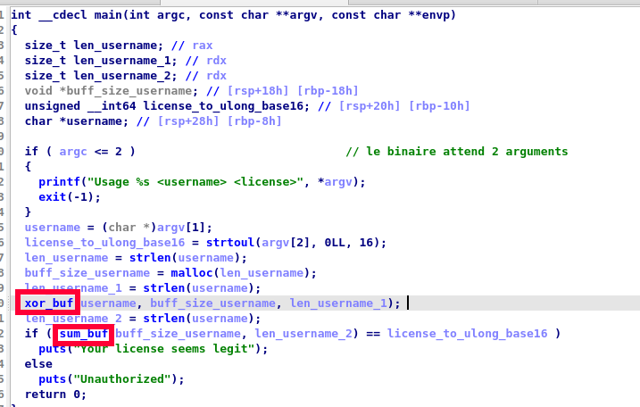

🕵️‍♀️ le buffer *username* va subir un premier traitement par une fonction nommée *xor_buf*. Ensuite, si la fonction *sum_buf* retourne une valeur égale à *license_to_ulong_base16* alors la license est valide.

##### Fonction xor_buf
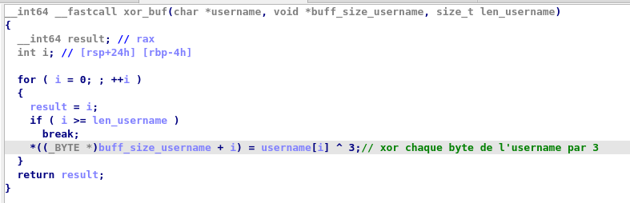
🕵️‍♀️ Cette fonction xor chaque byte de l'username par la clé 3

##### Fonction sum_buff


🕵️‍♀️ Dans cette fonction, on additionne chaque byte de username par chaque byte de username !

🚧 Pour plus de lisibilité dans le code, il est "important" de renommer et retyper les variables :

Avant le retypage, on avait cette fonction peu lisible : 
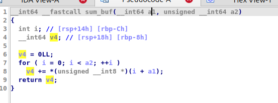
Concernant a1, on savait qu'il sagissait du buffer contenant username qui est de type 'char'. Le buffer est donc de type char * :
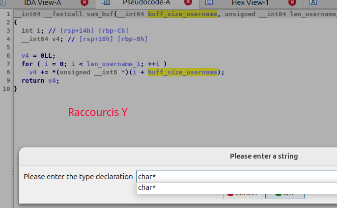

#### Exploitation

🕵️‍♀️ Il nous suffit de faire l'opération inverse pour trouver une license valide 
🕵️‍♀️ *Pré requis* : la génération de la license ne repose que sur le nom d'utilisateur. Ca tombe bien car nous savons qu'il s'agit de l'utilisateur "admin"

```python
from pwn import *

def xor_buff(username,xor_key):
    buf = []
    for char in username:
        buf.append(ord(char) ^ xor_key)
    return buf

def sum_buff(xored_username):
    sum_username = 0
    for elem in xored_username:
        sum_username += elem

    return sum_username

username = 'admin'
xor_key = 0x3
pwn_args = []
xored_username = xor_buff(username,xor_key)
license = sum_buff(xored_username)

pwn_args.append(username)
pwn_args.append(hex(license))

io = process(['./1_chall'] + pwn_args)

print(io.recvall())

```


### 2 aargs

>consigne : Avec le bon input vous aurez un flag ;)

>ps: pas besoin d'analyser la fonction `power_mod`. Il s'agit, comme son nom l'indique, d'une exponentitation modulaire: `power_mod(a, b, c)` <-> `pow(a, b) % c`

💽 binaire : 2_chall
🇫🇷 HackUTT{as_tu_vu_la_crypto???}
#### Execution du binaire

Nous n'avons aucun output lors de l'execution du binaire

#### Résolution du chall

🕵️‍♀️ Dans le main, on a une boucle qui incrémente un i de **1** à **nbr d'argument total** . 
🕵️‍♀️ Si un argument est égal à '-' alors la fonction break
🕵️‍♀️ Ensuite il y a un second break si on est dans cette condition : 

` if ( arg_to_int != -power_number )`

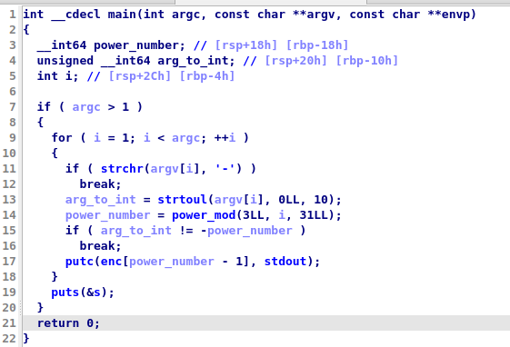
Donc il faut respecter la condition : 

`arg_to_int == -power_number`

si i = 1 alors pow(3,i31) = 3

```python
>>> pow(3,1,31)
3
```

donc il nous faut entrer -3 dans le premier argument ! 
🤡 Hors, on ne peut pas ! Et oui, le char '-' n'est pas autorisé... Pour contourner ca, on va utiliser la version signée de l'entier 64 bits '-3'.

On peut l'obtenir ainsi en python : 

```python
signed_int = -3
unsigned_int = signed_int & 0xFFFFFFFFFFFFFFFF
print(unsigned_int)
```
==18446744073709551613==

🕵️‍♀️ testons cela : 

It workssss : 
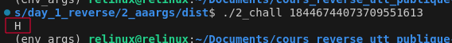

🕙 Bon, maintenant il nous faut faire cela pour chaque argument !!!
Sachant que si on regarde bien dans la data envoyé par putc, la chaîne à décoder fait 30 characters : 

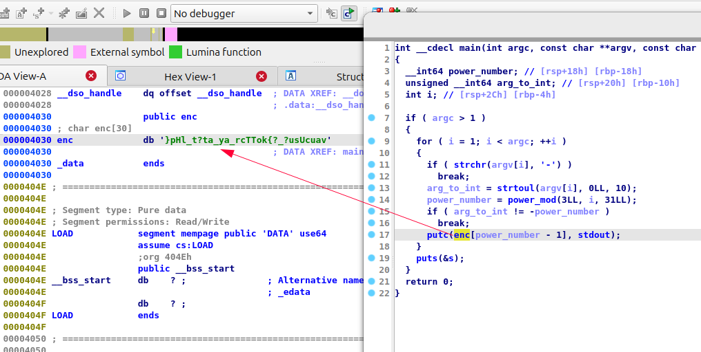

Voici le code : 
```python
from pwn import *

arg_list = []

for nbr_args in range(1,31):
    pow_number = pow(3,nbr_args,31)
    arg_list.append(str(-pow_number & 0xffffffffffffffff))

    
io = process(['./2_aaargs'] + arg_list)

print(io.recvall())
```
```text
s/day_1_reverse/2_aaargs/dist$ python3 exploit.py 
[+] Starting local process './2_aaargs': pid 18847
[+] Receiving all data: Done (31B)
[*] Process './2_aaargs' stopped with exit code 0 (pid 18847)
b'HackUTT{as_tu_vu_la_crypto???}\n'
```
### License harder

>consigne : Le grand Walter White a écrit un programme lui permettant de restreindre l'accès à ses données “professionnelles”. Il distribue des licenses au compte-gouttes, mais vous avez néanmoins récupéré une license qu'il a générée pour son fils !

>Son système propose deux niveaux de licenses : une basique, et vous souhaitez obtenir une license “admin”.

>Le programme ci-joint vérifie entre autres le niveau de privilèges de la license, et vous récompense si vous présentez une license “admin”.

`openssl s_client -verify_quiet -quiet -connect license.serviel.fr:1234`

💽 binaire : 3_chall

#### Résolution du chall

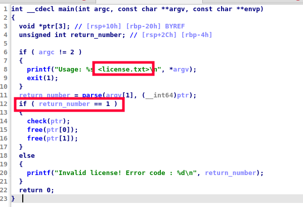

🕵️‍♀️ ici le binaire prend un fichier texte et le parse. Si la valeur de retour de la fonction "parse" est égal à 1 alors on est bon !

🕵️‍♀️ La fonction de parsing vérifie le contenu du fichier : 
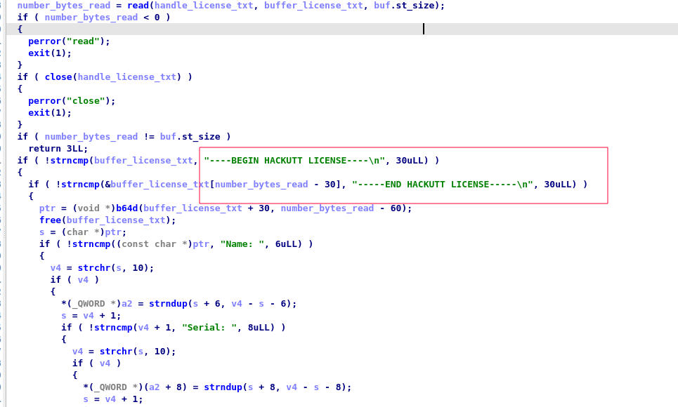

🕵️‍♀️ Les 30 premiers bytes doivent être égals à : 
"----BEGIN HACKUTT LICENSE----\n"
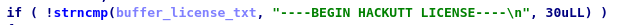
🕵️‍♀️ Les 30 derniers bytes doivent être égals à :
"-----END HACKUTT LICENSE-----\n"
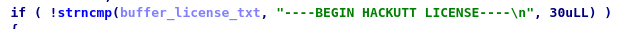

🕵️‍♀️ Ensuite il decode le contenu aprés les 30 premiers octets et avant les 60 derniers octets :
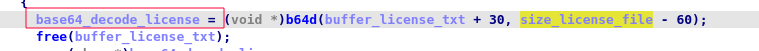

🕵️‍♀️ Les 6 premier charactére de la valeur décodé doivent être égal à "Name: '' 
🕵️‍♀️ Ensuite le code va jusqu'au retour à la ligne
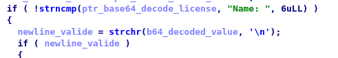

🕵️‍♀️ Idem pour "Serial: " puis retour à la ligne
🕵️‍♀️Idem pour le type. Enfin on a une structure de fichier comme ceci avant le base64 : 

```txt
----BEGIN HACKUTT LICENSE----
Name: 
Serial: 
Type: 

-----END HACKUTT LICENSE-----
```
💡 Tu peux suivre les codes erreur de retour pour t'aider. Exemple : 

🕵️‍♀️ Voici un snippet pour créer la base du fichier
```python
from pwn import *
import base64

filename = "./license.txt"
header = "----BEGIN HACKUTT LICENSE----\n"
footer = "-----END HACKUTT LICENSE-----\n"
body = """Name: admin
Serial: 1
Type: 1
"""

def convert_body_to_b64(body):
    return base64.b64encode(body.encode("utf-8"))

def create_license_file(filename,body_base64):
    with open(filename,"w") as file:
        file.write(header)
        file.write(body_base64 + '\n')
        file.write(footer)

body_base64 = convert_body_to_b64(body).decode("utf-8")
print(f"{body_base64}")
create_license_file(filename,body_base64)


args = []
args.append(filename)
io = process(["./3_chal"] + args)
print(io.recvall())
```


💡Bon, c'est bien beau, mais ça ne nous donnes pas les valeurs possibles !! 
🕵️‍♀️ En y regardant de plus prêt, on voit qu'il place les éléments contenu dans "Name Serial" et "Type" dans une zone mémoire. Je vais mettre en place une struct pour faciliter la visualisation. On sait que la struct devra contenir 3 valeurs de la taille d'un int64:
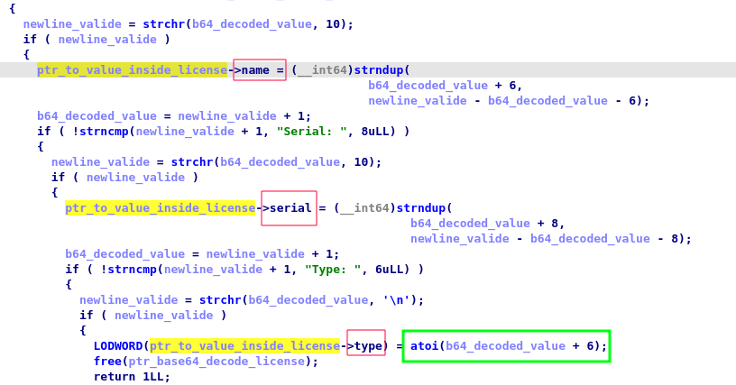

D'ailleurs la valeur "Type" sera converti en int (atoi) !

##### Création de la structure

1️⃣ Création de la nouvelle structure : 
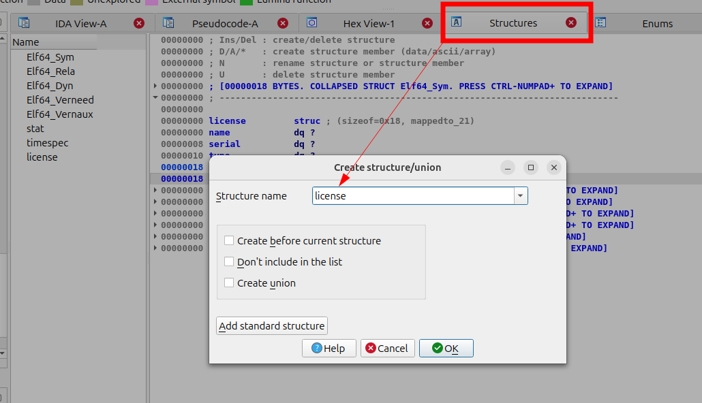

2️⃣ Ajouts des trois éléments :
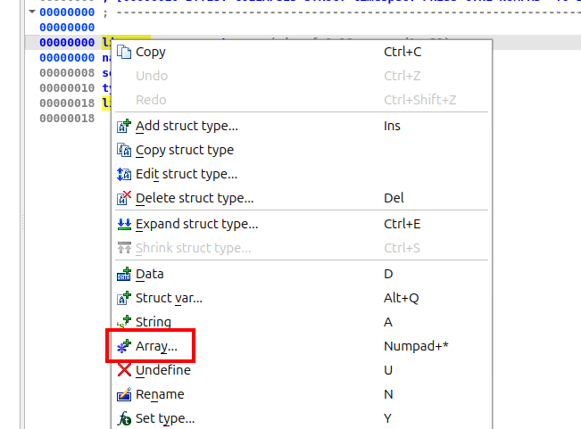

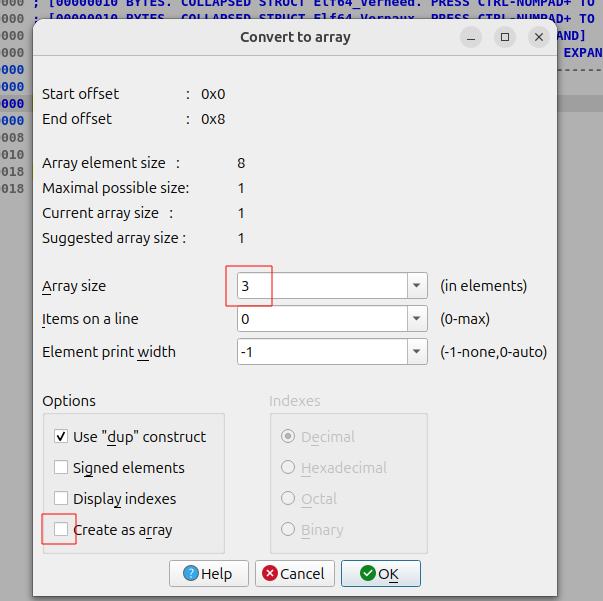
🚧 Chaque élément est un 'dq', pour rappel : 

- db -> define byte (1 byte : 8 bits)
- dw -> define word (2 bytes : 16 bits)
- dd -> define double word (4 bytes : 32 bits)
- dq -> define quad word (8 bytes : 64 bits)

Tu peux aussi créer une structure avec : 

1️⃣ shift + F9 
2️⃣ insert 
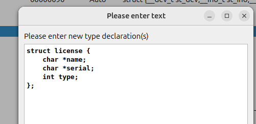
##### fonction check 
🕵️‍♀️ Bon, on peut se rendre dans la fonction check pour vérifier ce que le programme attend : 

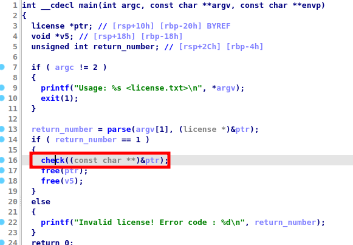

Avec le retypage en struct c'est beaucoup plus clair !!

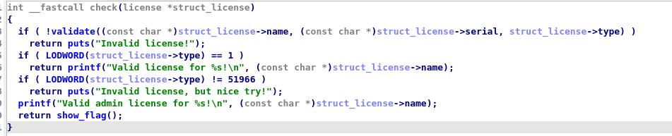

🕵️‍♀️ La fonction validate check si le sha256 de la concaténation des valeurs name et type soit égal à la valeur hexadecimal de serial : 

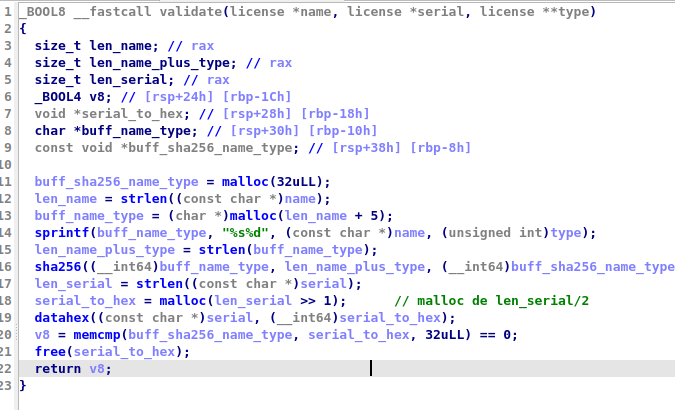

🕵️‍♀️ Exploitation : 
```python
from pwn import *
import base64
import hashlib

filename = "./license.txt"
header = "----BEGIN HACKUTT LICENSE----\n"
footer = "-----END HACKUTT LICENSE-----\n"

name = "admin"
type = "1"
serial = "1"

def convert_body_to_b64(body):
    return base64.b64encode(body.encode("utf-8"))

def create_license_file(filename,body_base64):
    with open(filename,"w") as file:
        file.write(header)
        file.write(body_base64 + '\n')
        file.write(footer)

def generate_serial_and_body():
    serial = hashlib.sha256((name + type).encode("utf-8"))
    body = """Name: {name}
Serial: {serial}
Type: {type}
    
    """.format(name=name, type= type, serial=serial.hexdigest())
    return body 


body = generate_serial_and_body()
print(body)
body_base64 = convert_body_to_b64(body).decode("utf-8")
create_license_file(filename,body_base64)
```

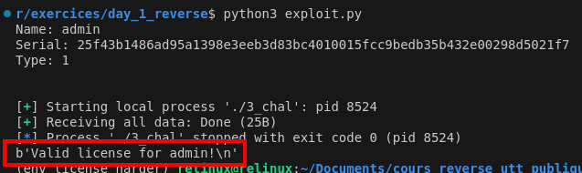
🕵️‍♀️ Et enfin, pour valider le chall, il faut que le type soit égal à 51966 : 
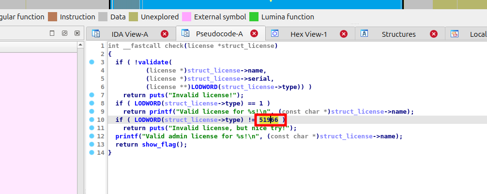

🕵️‍♀️ Modifions notre code : 
```python
from pwn import *
import base64
import hashlib

filename = "./license.txt"
header = "----BEGIN HACKUTT LICENSE----\n"
footer = "-----END HACKUTT LICENSE-----\n"

name = "admin"
type = "51966"
serial = "1"

def convert_body_to_b64(body):
    return base64.b64encode(body.encode("utf-8"))

def create_license_file(filename,body_base64):
    with open(filename,"w") as file:
        file.write(header)
        file.write(body_base64 + '\n')
        file.write(footer)

def generate_serial_and_body():
    serial = hashlib.sha256((name + type).encode("utf-8"))
    body = """Name: {name}
Serial: {serial}
Type: {type}
    
    """.format(name=name, type= type, serial=serial.hexdigest())
    return body 


body = generate_serial_and_body()
print(body)
body_base64 = convert_body_to_b64(body).decode("utf-8")
create_license_file(filename,body_base64)


args = []
args.append(filename)
io = process(["./3_chal"] + args)
print(io.recvall())
```
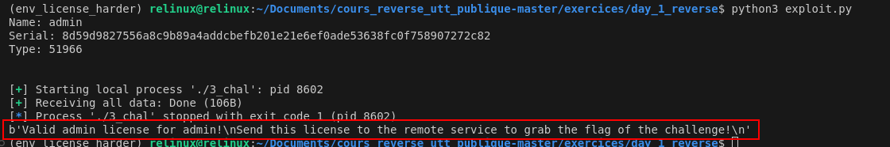

###  Broken

>consigne : J'ai developpé un programme qui est censé me donner directement le flag mais visiblement il est cassé :/

>Aidez moi à le réparer

`openssl s_client -verify_quiet -quiet -connect broken.serviel.fr:1234`

💽 binaire : 4_chall

Le serveur n'est plus accessible


